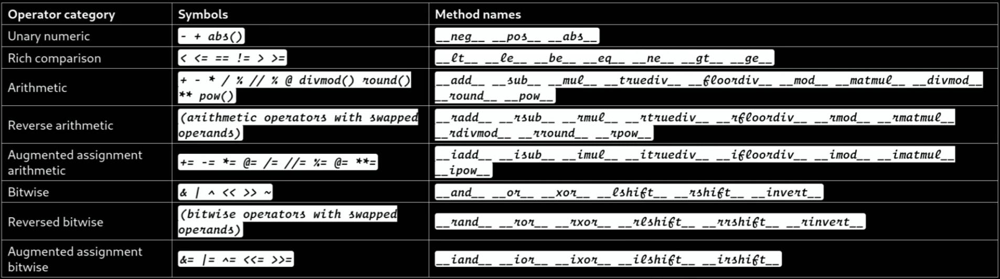

# Operators

## Description

- The “i” symbol means “in place”
- The “a” symbol means “asynchronous”
- The “r” symbol means “reverse”
- When we are implementing the “Rich comparison” method we should return a new object, in the other hand for the “Augmented assignment arithmetic” method we should update the current object
