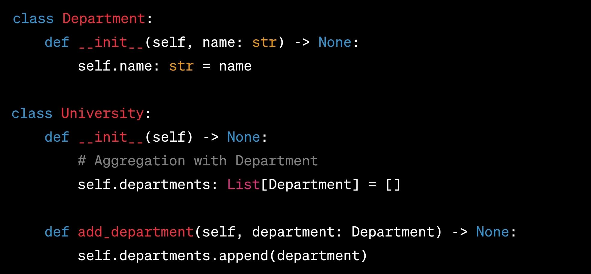

# Aggregation (Constructor List)

## Description

- Represents a weaker form of "has-a" relationship compared to composition.
- It is shown as an empty diamond shape with a line connecting the aggregate class to the component class.
- The component class can exist independently, and there is a more relaxed relationship between the two.

## Sample Code

