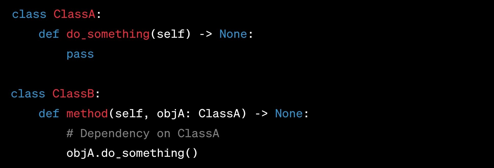

# Dependency (Method Access)

## Description

- Represents a relationship where one class relies on another class, but changes in the dependent class do not affect the independent class.
- Shown as a dashed line with an arrow pointing from the dependent class to the independent class.
- Indicates that a change in the independent class might impact the dependent class, but not vice versa.

- The Food relation is a Dependency
- The Address relation is the Association

## Sample Code

