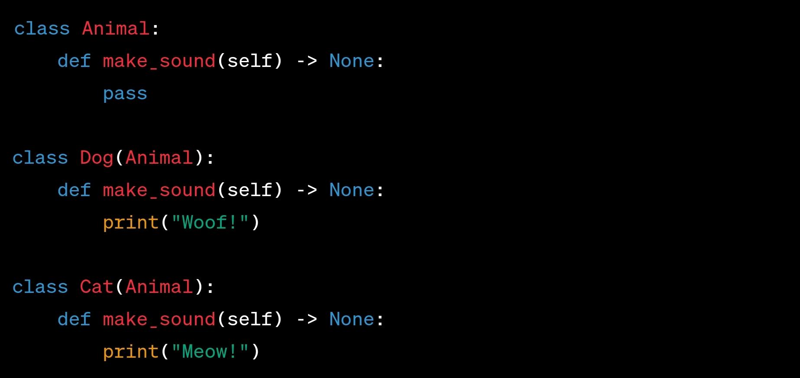

# Generalization (Extend)

## Description

- Inheritance from other classes
- Represents an "is-a" relationship between classes.
- Shown as a solid line with a hollow arrowhead pointing from the subclass to the superclass.
- Enables code reuse and establishes a hierarchy among classes.

## Sample Code

