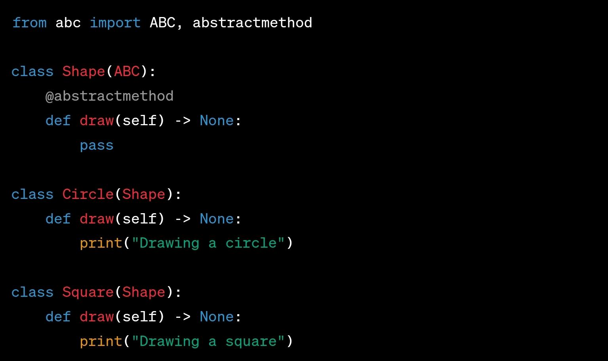

# Realization (Implementation)

## Description

- Inheritance from other interfaces
- Represents the implementation of an interface by a class or component.
- Shown as a dashed line with a hollow triangle arrowhead pointing from the class realizing the interface to the interface itself.
- Indicates that the realizing class provides the actual implementation for the operations defined in the interface.

## Sample Code

