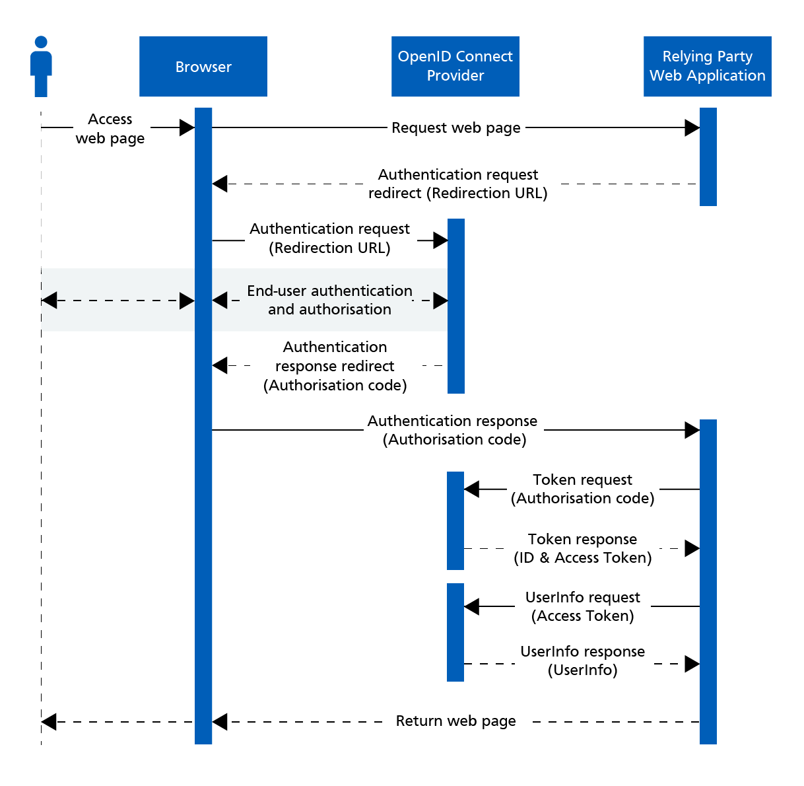

# OAuth2 [OIDC]

## Description

- Framework for token-based authentication and authorization.
- Enables secure third-party access to resources without sharing user credentials.
- Uses access tokens and refresh tokens for granting and managing access.
- Introduces the concept of **scopes** to define the extent of access requested by a client application.
- Provides flexibility for various authorization scenarios.
- OAuth 2.0 is focused on **authorization**, **not authentication**.

## OpenID Connect (OIDC)

- Built on top of OAuth 2.0.
- Adds an authentication layer to OAuth 2.0.
- Specifically designed for user authentication.
- Provides an identity layer for obtaining user profile information.
- Uses JWTs for transmitting user information in a compact, standardized format.

## Use Cases

- Securing APIs and enabling third-party integrations.
- Authorization for web and mobile applications.
- Consumer-facing applications requiring user-friendly authentication.
- Scenarios where both authentication and authorization are needed.
