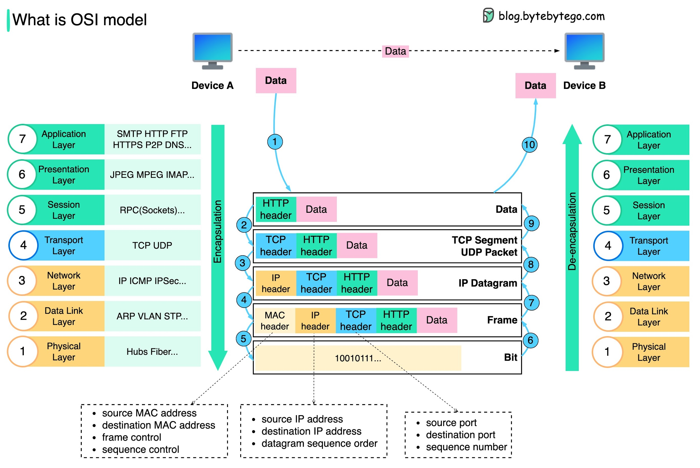

# OSI Model

## Description

## Layers

| Layer              | Key Protocols/Concepts                                                                              | Key Function                              |
|--------------------|-----------------------------------------------------------------------------------------------------|-------------------------------------------|
| **7.Application**  | DNS, WWW/HTTP, P2P, EMAIL/POP, SMTP, Telnet, FTP                                                    | Network Process to Application            |
| **6.Presentation** | Recognizing Data: HTML, DOC, JPEG, MP3, AVI, Sockets                                                | Data Representation and Encryption        |
| **5.Session**      | Session Establishment in TCP, SIP, RTP, RPC-Named Pipes                                             | Interhost Communication                   |
| **4.Transport**    | TCP, UDP, SCTP, SSL, TCL                                                                            | End-to-End Connection and Reliability     |
| **3.Network**      | IP, ARP, IPsec, ICMP, IGMP, OSPF                                                                    | Path Determination and Logical Addressing |
| **2.Data Link**    | Ethernet, 802.11, MAC/LLC, VLAN, ATM, HDP, Fibre Channel, Frame Relay, HDLC, PPP, Q.921, Token Ring | Physical Addressing                       |
| **1.Physical**     | RS-232, RJ45, V.34, 100BASE-TX, SDH, DSL, 802.11                                                    | Media, Signal and Binary Transmission     |
