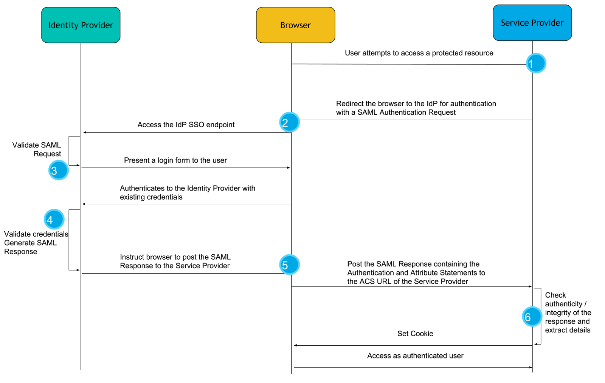

# SAML

## Overview

SAML (Security Assertion Markup Language) is an XML-based protocol designed for exchanging authentication and authorization data between parties in a secure and standardized manner. It facilitates Single Sign-On (SSO) and enables the secure exchange of user information between an Identity Provider (IdP) and a Service Provider (SP).

## Key Components

### Assertions

- XML documents that contain information about a user's identity, attributes, and authentication status.
- Generated by the IdP and consumed by the SP.

### Protocols

- Defines various protocols for different scenarios, such as Single Sign-On (SSO) and Single Logout (SLO).
- Web Browser SSO profile is a common protocol for SAML-based SSO.

### Bindings

- Supports different bindings for transmitting assertions and messages over various communication protocols (e.g., HTTP POST, HTTP Redirect).

### Profiles

- Defines specific use cases and rules for how SAML assertions and protocols should be used.
- Examples include the Web Browser SSO Profile and the Single Logout Profile.

## Use Cases

- **Enterprise SSO:** Commonly used for Single Sign-On in enterprise environments.
- **Federated Identity:** Enables identity federation across different organizations.
- **Web-based Applications:** Widely used for securing access to web applications and services.
