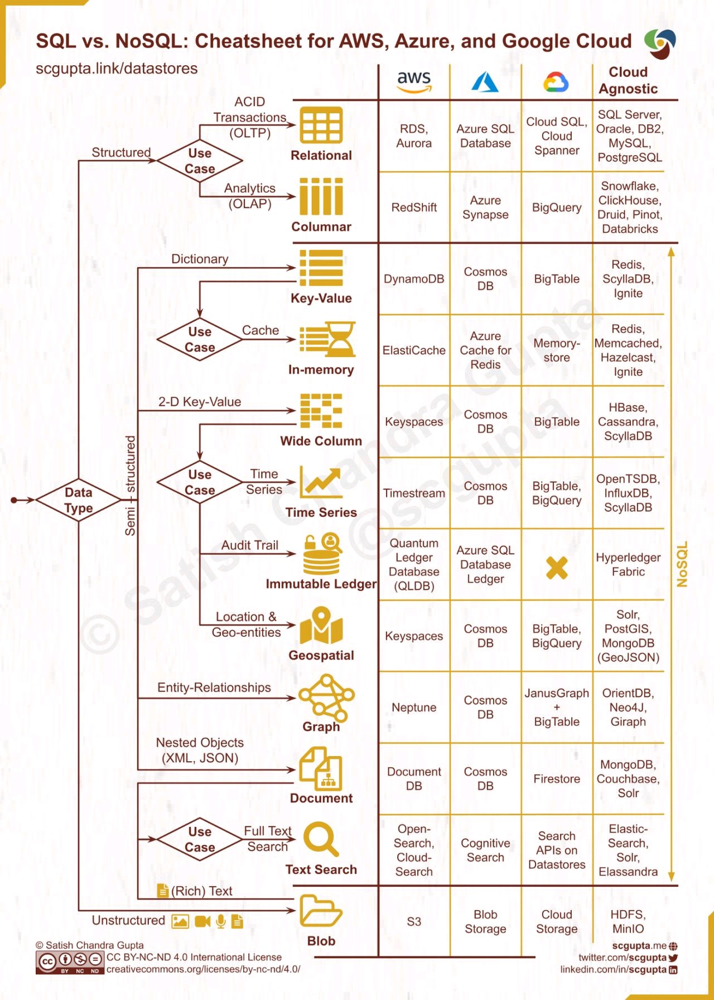
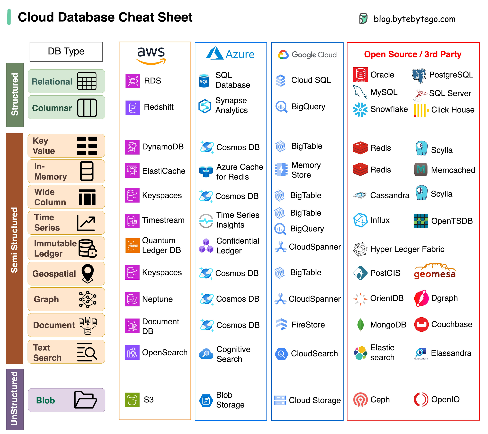

# Storage Selection

## Storage Types

Data can be structured (SQL table schema), semi-structured (JSON, XML, etc.), and unstructured (Blob).

Common database categories include:

- Relational
- Columnar
- Key-value
- In-memory
- Wide column
- Time Series
- Immutable ledger
- Geospatial
- Graph
- Document
- Text search
- Blob

## Storage Selection Diagrams

