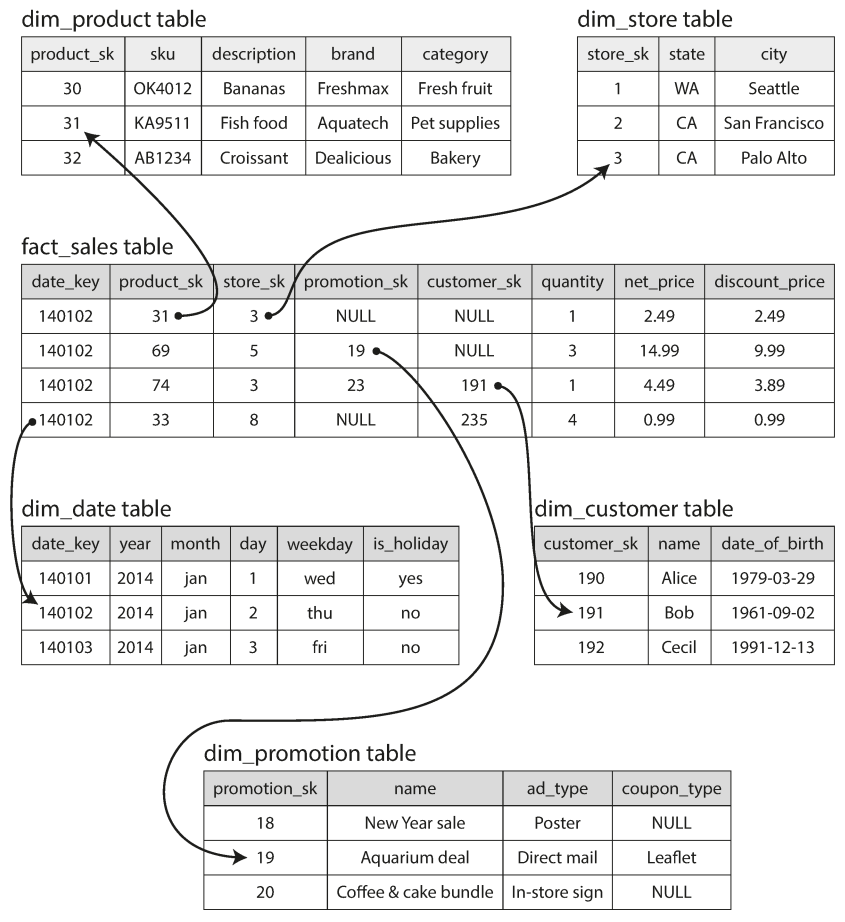

# Star Schema

## Description

Many data warehouses are used in a fairly formulaic style, known as a star schema (also known as **dimensional modeling**) (The name "star schema" comes from the fact that when the table relationships are visualized, the fact table is in the middle, surrounded by its dimension tables; the connections to these tables are like the rays of a star.)

The following example shows a data warehouse that might be found at a grocery retailer.
At the center of the schema is a so-called **fact table** (in this example, it is called fact_sales).
Each row of the fact table represents an event that occurred at a particular time (here, each row represents a customer's purchase of a product).
If we were analyzing website traffic rather than retail sales, each row might represent a page view or a click by a user.

Usually, facts are captured as individual events, because this allows maximum flexibility of analysis later.

Some of the columns in the fact table are **attributes**, such as the price at which the product was sold and the cost of buying it from the supplier (allowing the profit margin to be calculated).
Other columns in the fact table are foreign key references to other tables, called **dimension tables**.
As each row in the fact table represents an event, the dimensions represent the **who, what, where, when, how,** and **why** of the event.

- For simplicity, if the customer buys several different products at once, they are represented as separate rows in the fact table.
- Event date and time are often represented using dimension tables, because this allows additional information about dates (such as public holidays) to be encoded, allowing queries to differentiate between sales on holidays and non-holidays.

## Snowflake Schema

A variation of "Start Schema" is known as the **Snowflake Schema**, where dimensions are further broken down into subdimensions.

For example, there could be separate tables for brands and product categories, and each row in the dim_product table could reference the brand and category as foreign keys, rather than storing them as strings in the dim_product table.

Snowflake schemas are more normalized than star schemas, but star schemas are often preferred because they are simpler for analysts to work with.
