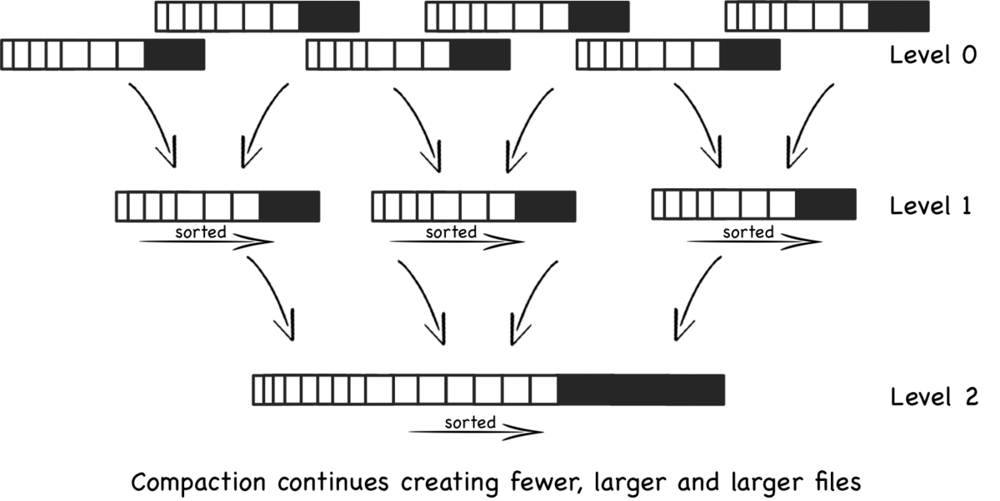
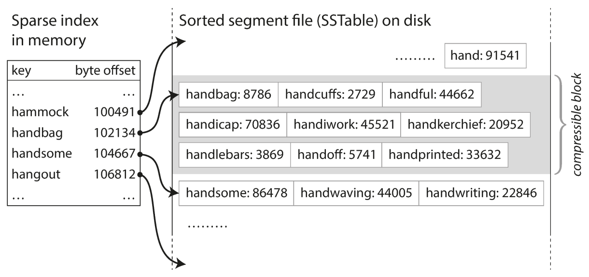
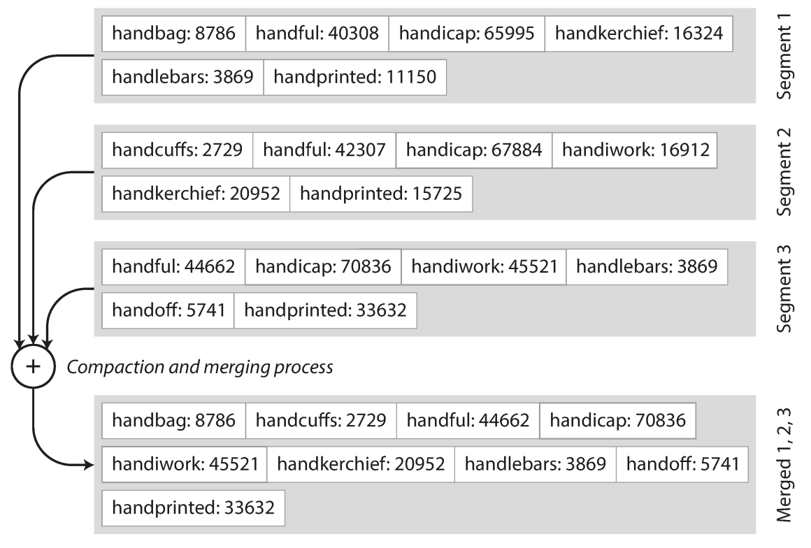

# LSM-Tree Storeage Structure

## Overview

A Log-Structured merge tree (LSM tree) is a data structure used in computer science for efficiently storing and retrieving key-value pairs.
It is particularly well-suited for write-intensive workloads and is commonly employed in storage systems such as databases and distributed file systems.
The LSM tree is designed to optimize write operations by minimizing disk I/O and ensuring efficient compaction. (LSM tree uses SSTable internally)

- **Write-Ahead Log (WAL)**: Incoming write operations are first appended to a write-ahead log. This ensures durability and helps in recovering data in case of failures.
- **Memtable**: Write operations are also stored in an in-memory data structure called a memtable for faster writes. Once the memtable is full, it is flushed to disk as an SSTable (Sorted String Table).
- **Sorted String Tables (SSTables)**: SSTables are immutable on-disk structures that contain sorted key-value pairs. These SSTables are periodically merged to reduce the number of files and improve read efficiency.
- **Levels**: LSM trees typically have multiple levels, with each level containing SSTables. The first level (Level 0) consists of the most recent SSTables, while subsequent levels have larger SSTables that result from merging and compacting lower-level SSTables. Level 0 is usually compacted more frequently than higher levels.
- **Compaction**: Periodically, the LSM tree undergoes a compaction process where overlapping SSTables are merged, and obsolete data is removed. This process helps to reclaim space and improve read performance.

## Sorted String Tables (SSTables)

SSTable, which stands for "Sorted String Table" is a data structure used in various database systems, particularly in distributed and NoSQL databases.
SSTables are designed for efficient read-and-write operations in scenarios where data needs to be stored on disk and accessed quickly.

- Each log-structured storage segment is a **sequence of key-value pairs**. The sequence of key-value pairs is sorted by key. (We call this format **Sorted String Table**, or **SSTable** for short.)
- **Sorted Structure**: SSTables are typically sorted based on the keys, allowing for efficient range queries. This sorting enables faster lookups and range scans.
- **Immutable**: Once an SSTable is written, it is generally considered immutable. This immutability simplifies the handling of concurrent read and write operations and facilitates efficient snapshots for consistent backups.
- **Compaction**: Over time, as new data is written and updates occur, multiple SSTables may exist. Compaction is the process of merging and consolidating these SSTables to reduce storage space and improve read efficiency. Compaction helps in avoiding the creation of too many small files and maintaining a manageable data structure.
- **Bloom Filters**: SSTables often use Bloom filters to efficiently check whether a particular key exists in the SSTable or not. Bloom filters are probabilistic data structures that provide a quick and memory-efficient way to check for membership in a set.
- **Column Families**: SSTables are commonly used in column-family databases, where data is organized by columns rather than rows. Each SSTable can represent a particular column family, and multiple SSTables can be used to store different column families within a keyspace.

## Storage Structure

### Primary Structure

We only keep part of the keys in memory.

### Compaction Scenario

