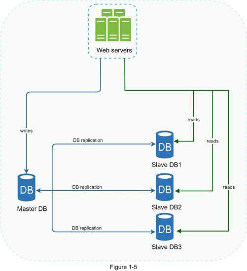

# Overview

## Description

Quoted from Wikipedia: "Database replication can be used in many database management systems, usually with a master/slave relationship between the original (master) and the copies (slaves)"

A **master database** generally only **supports write operations**.
A **slave database** gets copies of the data from the master database and only **supports read operations**.

All the data-modifying commands like insert, delete, or update must be sent to the master database.
Most applications require a much higher ratio of reads to writes; thus, the number of slave databases in a system is usually larger than the number of master databases.

Possible replication approaches:

- Leaders & Followers
- Multi-Leader Replication
- Leaderless Replication
