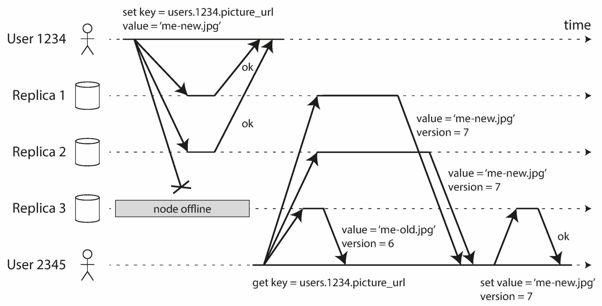
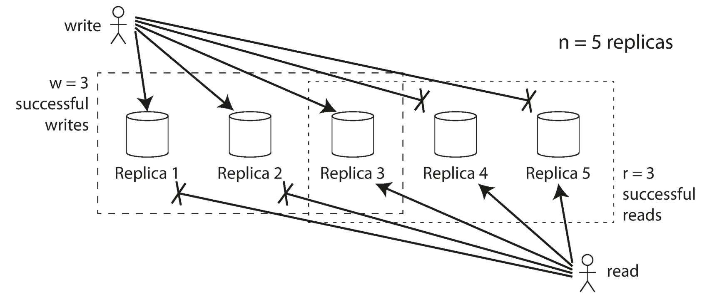

# Approach: Leaderless Replication

## Description

In a leaderless configuration, failover does not exist.
For example in the following picture, the client (user 1234) **sends the write to all replicas in parallel**, and the two available replicas accept the write but the unavailable replica misses it.
Let's say that it's sufficient for two out of three replicas to acknowledge the writing:

- After user 1234 has received two ok responses, we consider the write to be successful.
- The client simply ignores the fact that one of the replicas missed the write.

Now imagine that the unavailable node comes back online, and clients start reading from it.
Any writes that happened while the node was down are missing from that node.
Thus, if you read from that node, you may get stale (outdated) values as responses.

To solve that problem, when a client reads from the database, it doesn't just send its request to one replica: **read requests are also sent to several nodes in parallel**. The client may get different responses from different nodes; i.e., the up-to-date value from one node and a stale value from another. Version numbers are used to determine which value is newer.

## Quorums For Reading and Writing

If there are $n$ replicas, every write must be confirmed by $w$ nodes to be considered successful, and we must query at least $r$ nodes for each read. (In our example, $n=3$, $w=2$, $r=2$.) As long as $w + r > n$, we expect to get an up-to-date value when reading, because at least one of the $r$ nodes we're reading from must be up to date. Reads and writes that obey these $r$ and $w$ values are **called quorum reads and writes**.

You can think of r and w as the minimum number of votes required for the read or write to be valid.

For example:

- If $w < n$, we can still process writes if a node is unavailable.
- If $r < n$, we can still process reads if a node is unavailable.
- With $n=3$, $w=2$, $r=2$ we can tolerate one unavailable node.
- With $n=5$, $w=3$, $r=3$ we can tolerate two unavailable nodes.
- Normally, reads and writes are always sent to all $n$ replicas in parallel. The parameters $w$ and $r$ determine how many nodes we wait for, and how many of the n nodes need to report success before we consider the read or write to be successful.

For example when $n=5$, $w=3$, and $r=3$:

## Eventual Consistency

The replication scheme should ensure that eventually all the data is copied to every replica.
After an unavailable node comes back online, how does it catch up on the writes that it missed?

Two mechanisms are often used in Dynamo-style datastores:

- **Read repair**: When a client makes a read from several nodes in parallel, it can detect any stale responses. For example, user 2345 gets a version 6 value from replica 3 and a version 7 value from replicas 1 and 2. The client sees that replica 3 has a stale value and writes the newer value back to that replica. This approach works well for values that are frequently read.
- **Anti-entropy process**: In addition, some data stores have a background process that constantly looks for differences in the data between replicas and copies any missing data from one replica to another. Unlike the replication log in leader-based replication, this anti-entropy process does not copy writes in any particular order, and there may be a significant delay before data is copied.
