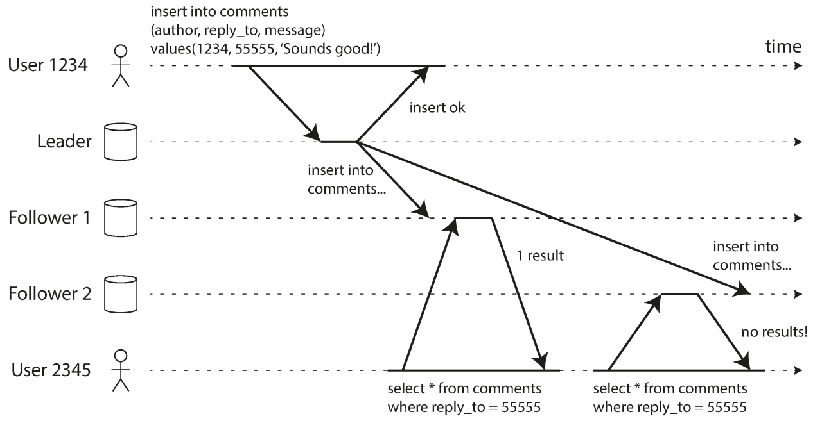
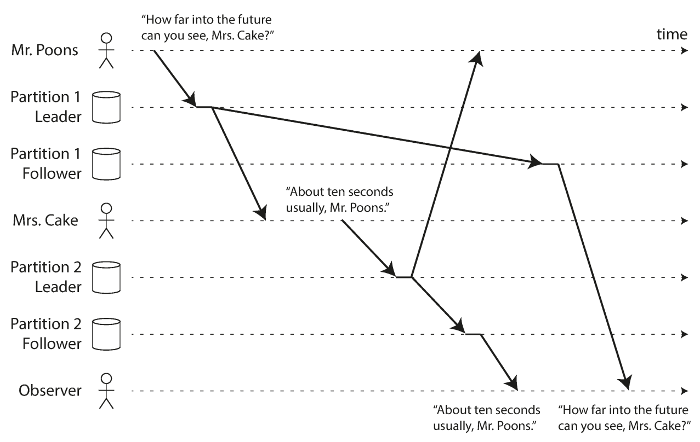

# Replication Lag Problem

## Description

Replication lag refers to the delay between changes made to a database in a Leader instance and the propagation of those changes to one or more Followers instances.

In database replication setups, where data is copied from one database server (the Leader) to another (the Follower), replication lag can occur due to various factors such as network latency, the workload on the replica server, and the efficiency of the replication process itself.

## Anomaly Variations

### Monotonic Reads

An anomaly that can occur when reading from asynchronous followers is that a user can see things moving backward in time.

This can happen if a user makes several reads from different replicas. For example, the following picture shows user 2345 making the same query twice, first to a follower with little lag, and then to a follower with greater lag. (This scenario is quite likely if the user refreshes a web page, and each request is routed to a random server.)

**Monotonic reads** is a guarantee that this kind of anomaly does not happen. It's a lesser guarantee than strong consistency, but a stronger guarantee than eventual consistency. When you read data, you may see an old value; monotonic reads only means that if one user makes several reads in sequence, they will not see time go backward— i.e., they will not read older data after having previously read newer data.

One way of achieving monotonic reads is to make sure that each user always makes their reads from the same replica (different users can read from different replicas). For example, the replica can be chosen based on a hash of the user ID, rather than randomly. However, if that replica fails, the user's queries will need to be rerouted to another replica.

### Consistent Prefix Reads

Another example of replication lag anomalies concerns the violation of causality. Imagine the following short dialog between Mr. Poons and Mrs. Cake:

- Mr. Poons: How far into the future can you see, Mrs. Cake?
- Mrs. Cake: About ten seconds usually, Mr. Poons.

There is a causal dependency between those two sentences: Mrs. Cake heard Mr. Poons's question and answered it.

Now, imagine a third person is listening to this conversation through followers. The things said by Mrs. Cake go through a follower with little lag, but the things said by Mr. Poons have a longer replication lag. This observer would hear the following:

- Mr. Poons: How far into the future can you see, Mrs. Cake?
- Mrs. Cake: About ten seconds usually, Mr. Poons.

To the observer, it looks as though Mrs. Cake is answering the question before Mr. Poons has even asked it. Such psychic powers are impressive but very confusing!

Preventing this kind of anomaly requires another type of guarantee: **consistent prefix reads**. This guarantee says that if a sequence of writes happens in a certain order, then anyone reading those writes will see them appear in the same order.
