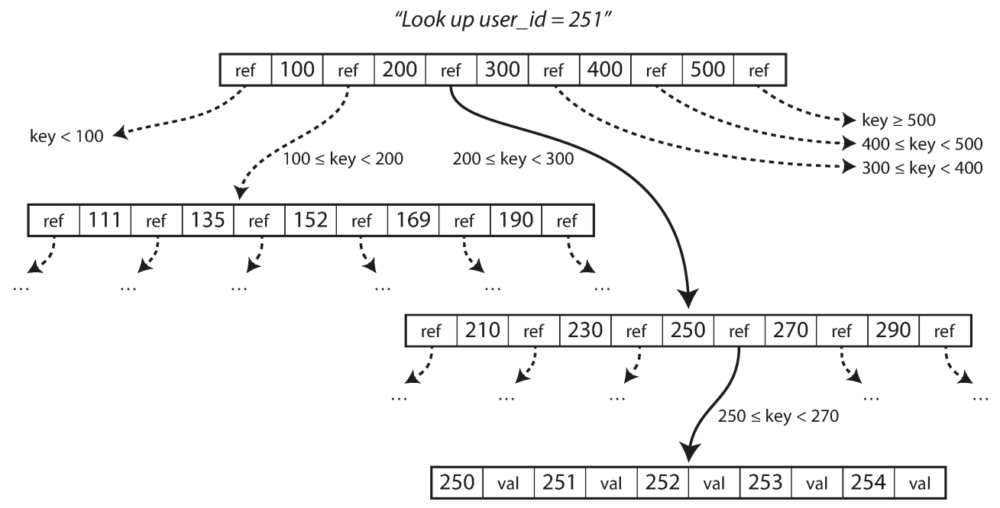
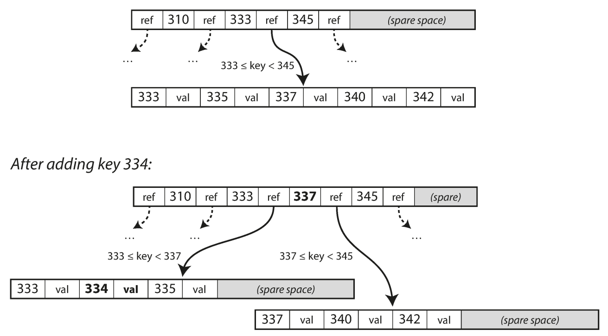

# B-Tree Storeage Structure

## Overview

B-trees break the database down into fixed-size blocks or pages, traditionally **4 KB** in size (sometimes bigger), and read or write one page at a time.
This design corresponds more closely to the underlying hardware, as disks are also arranged in fixed-size blocks.

Each page can be identified using an address or location, which allows one page to refer to another—similar to a pointer, but on disk instead of in memory.
We can use these page references to construct a tree of pages,

## Storage Structure

=== "Primary Structure"

    

=== "After Add/Update"

    If you want to update the value for an existing key in a B-tree, you search for the leaf page containing that key, change the value on that page, and write the page back to disk (any references to that page remain valid).

    If you want to add a new key, you need to find the page whose range encompasses the new key and add it to that page.
    If there isn't enough free space on the page to accommodate the new key, it is split into two half-full pages, and the parent page is updated to account for the new subdivision of key ranges

    
