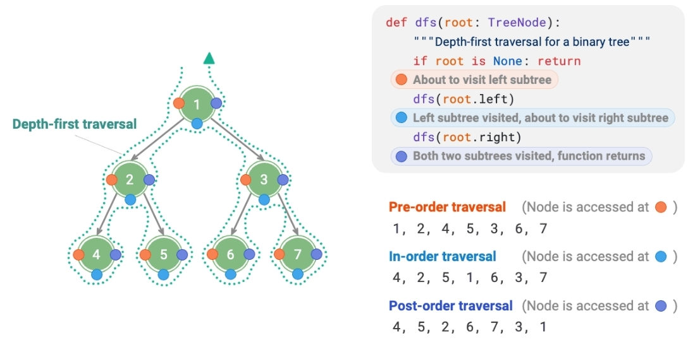

# Binary Tree

## Description

A binary tree is a hierarchical data structure in which each node has at most two children, referred to as the left child and the right child. The topmost node is called the root. The structure is recursive, as each child of a node can be the root of its own subtree.

- **Root node:** The node at the top level of the binary tree, which has no parent node.
- **Leaf node:** A node with no children, both of its pointers point to None.
- **Edge:** The line segment connecting two nodes, i.e., node reference (pointer).
- **The level of a node:** Incrementing from top to bottom, with the root node's level being 1.
- **The degree of a node:** The number of children a node has. In a binary tree, the degree can be 0, 1, or 2.
- **The height of a binary tree:** The number of edges passed from the root node to the farthest leaf node.
- **The depth of a node:** The number of edges passed from the root node to the node.
- **The height of a node:** The number of edges from the farthest leaf node to the node.

## Traversal

From a physical structure perspective, a tree is a data structure based on linked lists. Hence, its traversal method involves accessing nodes one by one through pointers. However, a tree is a non-linear data structure, which makes traversing a tree more complex than traversing a linked list, requiring the assistance of search algorithms.

The common traversal methods for binary trees include:

- Level-order traversal
- Pre-order traversal
- In-order traversal
- Post-order traversal

## Level-Order Traversal

Traverses the binary tree from top to bottom, layer by layer. Within each level, it visits nodes from left to right.

Level-order traversal is essentially a type of breadth-first traversal, also known as breadth-first search (BFS), which embodies a "circumferentially outward expanding" layer-by-layer traversal method.

## Preorder, In-order, and Post-order Traversal

Correspondingly, pre-order, in-order, and post-order traversal all belong to depth-first traversal, also known as depth-first search (DFS), which embodies a "proceed to the end first, then backtrack and continue" traversal method.

Depth-first traversal is like "walking" around the entire binary tree, encountering three positions at each node, corresponding to pre-order, in-order, and post-order traversal.

