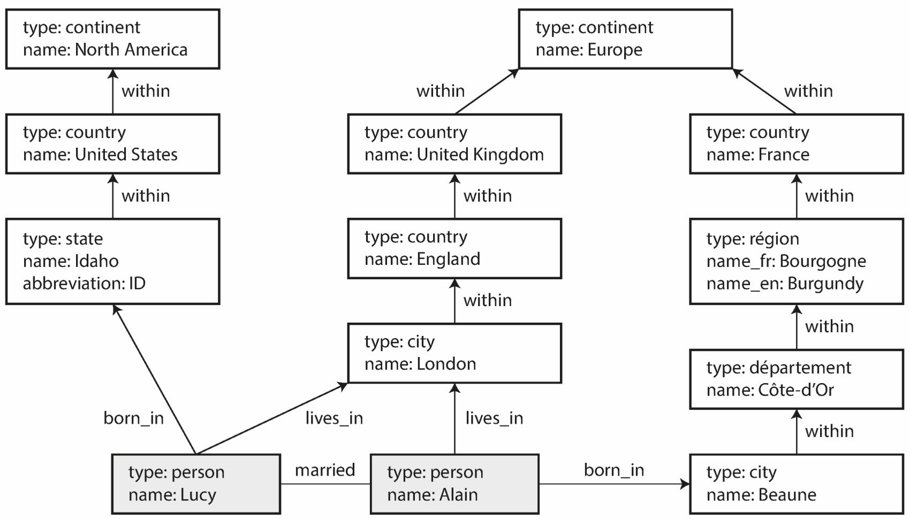

# Graph

## Description

- A collection of nodes connected by edges, representing relationships between nodes.
- many-to-many relationships in DB.
- Vertices: known as nodes or entities
- Edges: known as relationships or arcs
- Graphs are good for evolvability: as you add features to your application, a graph can easily be extended to accommodate changes in your application’s data structures.

Graphs are not limited to only homogeneous data: an equally powerful use of graphs is to provide a consistent way of storing completely different types of objects in a single datastore.

## Property Graphs

In the property graph model, each vertex consists of:

- A unique identifier
- A set of outgoing edges
- A set of incoming edges
- A collection of properties (key-value pairs)

Each edge consists of:

- A unique identifier
- The vertex at which the edge starts (the tail vertex)
- The vertex at which the edge ends (the head vertex)
- A label to describe the kind of relationship between the two vertices
- A collection of properties (key-value pairs)

## Triple-Stores Graphs

The triple-store model is mostly equivalent to the property graph model, using different words to describe the same ideas.

In a triple-store, all information is stored in the form of very simple three-part statements: (subject, predicate, object). For example, in the triple (Jim, likes, bananas), Jim is the subject, likes is the predicate (verb), and bananas is the object.

The subject of a triple is equivalent to a vertex in a graph. The object is one of two things:

1. A value in a primitive data type, such as a string or a number. In that case, the predicate and object of the triple are equivalent to the key and value of a property on the subject vertex. For example, (lucy, age, 33) is like a vertex lucy with properties {"age":33}.

2. Another vertex in the graph. In that case, the predicate is an edge in the graph, the subject is the tail vertex, and the object is the head vertex. For example, in (lucy, marriedTo, alain) the subject and object lucy and alain are both vertices, and the predicate marriedTo is the label of the edge that connects them.
