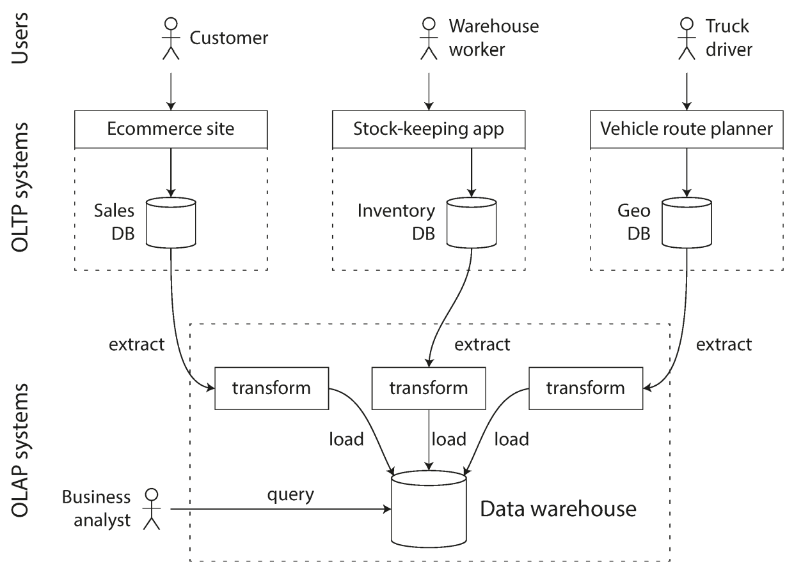

# DB Use Cases

## Description

- **OLTP (Online Transaction Processing):** This is designed for managing the day-to-day transactional operations of a business, such as order processing, inventory management, and customer transactions.
- **OLAP (Online Analytic Processing):** This is designed for complex queries and data analysis. It is used to analyze historical data and make informed business decisions
