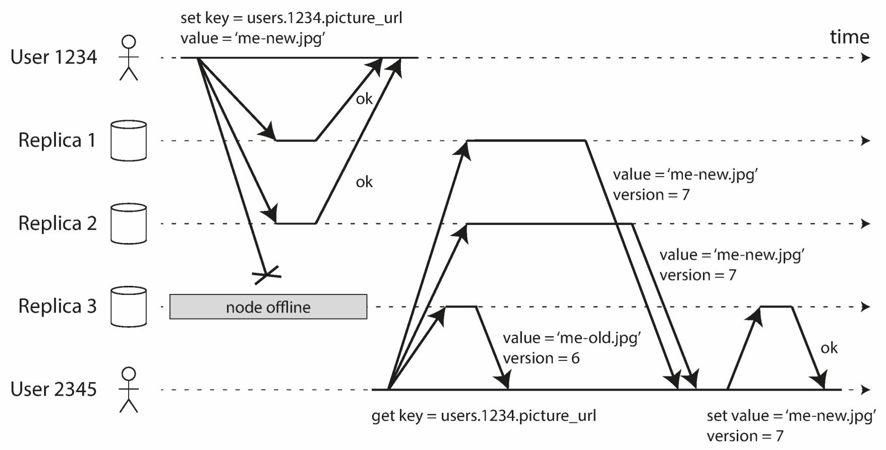
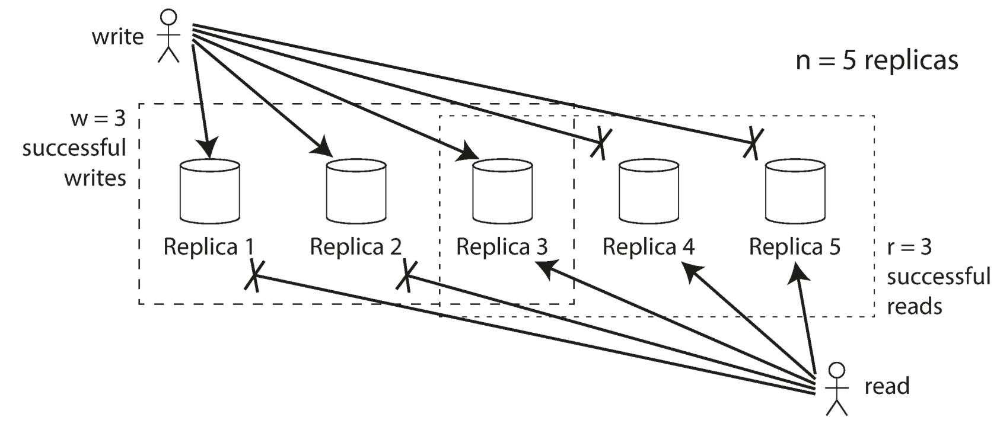

# Approach: Single-Leader Replication

## Description

When clients want to write to the database, they must send their requests to the **leader**, which first writes the new data to its local storage, whenever the leader writes new data to its local storage, it also sends the data change to all of its followers as part of a replication log or change stream. Each follower takes the log from the leader and updates its local copy of the database accordingly, by applying all writes in the same order as they were processed on the leader.

The most common solution for this is called **leader-based** replication (also known as **active/passive** or **master-slave** replication) and is illustrated in the following picture:

- Each node that stores a copy of the database is called a **replica**
- Every write to the database needs to be processed by every replica
- One of the replicas is designated the **leader** (also known as **master** or **primary**)
- The other replicas are known as **followers** (**read replicas**, **slaves**, **secondaries**, or **hot standbys**)
- When a **client wants to read from the database**, it can query either the **leader** or any of the **followers**. However, **writes are only accepted on the leader**
- leader-based replication is not restricted to only databases: distributed message brokers such as Kafka and RabbitMQ highly available queues also use it. Some network filesystems and replicated block devices such as DRBD are similar

## Synchronous & Asynchronous Replication

An important detail of a replicated system is whether the replication happens synchronously or asynchronously. (In relational databases, this is often a configurable option; other systems are often hardcoded to be either one or the other)

In the following picture we can see a leader-based replication with **one synchronous** and **one asynchronous** follower:

## Failover

Handling a failure of the leader is tricky, one of the followers needs to be promoted to be the new leader, clients need to be reconfigured to send their writes to the new leader, and the other followers need to start consuming data changes from the new leader.

## Variations

### Statement-Based Replication

In the simplest case, the leader logs every write request (statement) that it executes and sends that statement log to its followers. For a relational database, this means that every INSERT, UPDATE, or DELETE statement is forwarded to followers, and each follower parses and executes that SQL statement as if it had been received from a client.

### Logical (Row-Based) Log Replication

An alternative is to use different log formats for replication and for the storage engine, which allows the replication log to be decoupled from the storage engine internals. This kind of replication log is called a logical log, to distinguish it from the storage engine’s (physical) data representation.

A logical log for a relational database is usually a sequence of records describing writes to database tables at the granularity of a row

### Trigger-Based Replication

The replication approaches described so far are implemented by the database system, without involving any application code. In many cases, that’s what you want—but there are some circumstances where more flexibility is needed. For example, if you want to only replicate a subset of the data, or want to replicate from one kind of database to another, or if you need conflict resolution logic, then you may need to move replication up to the application layer.
