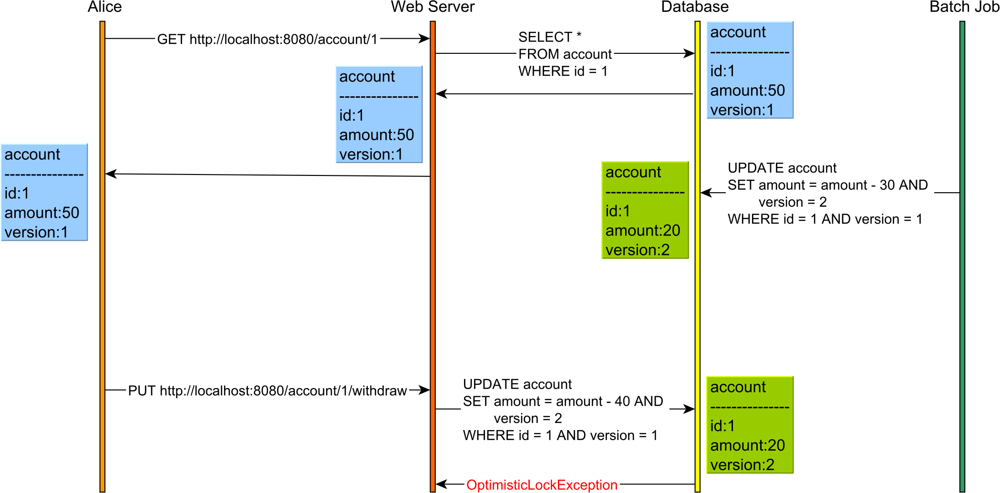

# Concurrency Control

## DB-Level Solution

### Pessimistic Locking

Pessimistic locking achieves this goal by taking a shared or read lock on the account so Bob is prevented from changing the account.

In the diagram above, both Alice and Bob will acquire a read lock on the account table row that both users have read. The database acquires these locks on SQL Server when using Repeatable Read or Serializable.

Because both Alice and Bob have read the account with the PK value of 1, neither of them can change it until one user releases the read lock. This is because a write operation requires a write/exclusive lock acquisition, and shared/read locks prevent write/exclusive locks.

Only after Alice has committed her transaction and the read lock was released on the account row, Bob UPDATE will resume and apply the change. Until Alice releases the read lock, Bob's UPDATE blocks.

### Optimistic Locking

Optimistic Locking allows the conflict to occur but detects it upon applying Alice's UPDATE as the version has changed.

This time, we have an additional version column. The version column is incremented every time an UPDATE or DELETE is executed, and it is also used in the WHERE clause of the UPDATE and DELETE statements. For this to work, we need to issue the SELECT and read the current version before executing the UPDATE or DELETE, as otherwise, we would not know what version value to pass to the WHERE clause or increment.

## Application-Level Solution

Relational database systems emerged in the late 70's early 80's when a client would, typically, connect to a mainframe via a terminal. That's why we still see database systems define terms such as SESSION setting.

Nowadays, over the Internet, we no longer execute reads and writes in the context of the same database transaction, and ACID is no longer sufficient.

For instance, consider the following use case:

Without optimistic locking, there is no way this Lost Update would have been caught even if the database transactions used Serializable. This is because reads and writes are executed in separate HTTP requests, hence on different database transactions.

So, optimistic locking can help you prevent Lost Updates even when using application-level transactions that incorporate the user-think time as well.

## Vs Transaction Isolation

- **Concurrency control** is a general term for any mechanism that handles issues that arise from concurrent connections.
- **Transaction isolation levels** are a mechanism by which DBMS implements concurrency control.
