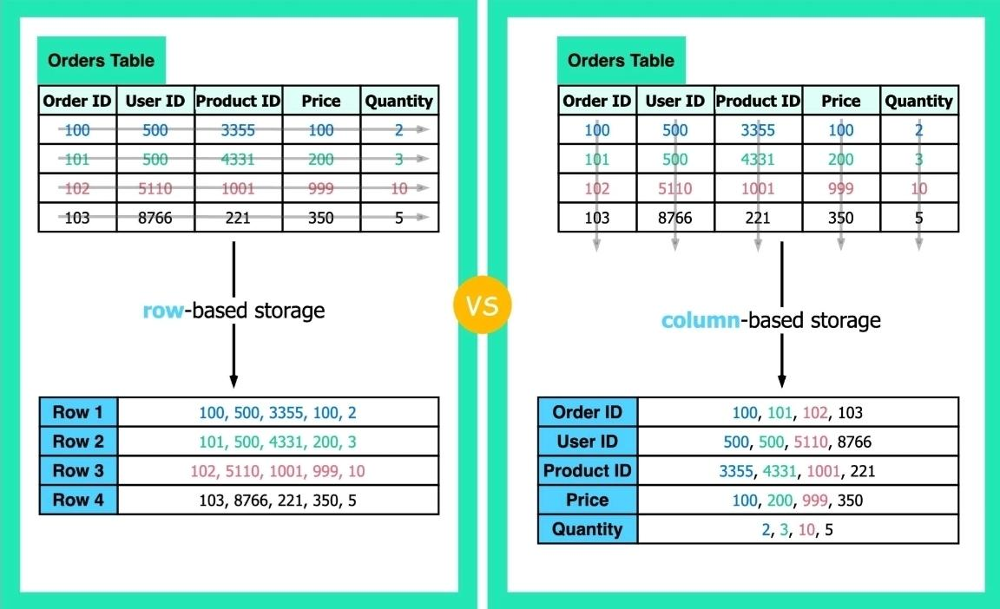

# Row-Based vs Column-Based

## Description

Databases come in two fundamental structures: row-based and column-based. This crucial decision determines how your data is stored – in rows or columns. The performance and scaling implications are significant.

- **Row-Based**: Store data in rows. All the information related to one record is stored together, making it easy to retrieve the full row.
- **Column-Based**: Store information by columns instead of rows. So a column will contain all values from the field across many rows and records.

## Query Performance

- **Row-Based**: Allow efficient retrieving of whole rows. This makes them more suitable for transactional processing requiring access to full records.
- **Column-Based**: Columnar stores excel at aggregate queries – like sums or averages - that look across many rows because one column contains all the relevant data to calculate stats. Analytics queries run much faster by reducing what data needs scanning.

## Scalability

- **Column-Based**: Column databases are often more scalable for analytical workloads since data is already stored by column. Expanding to store new large batches of records is easier with a column orientation. Column compression also saves considerable space for massive data volumes. This makes column stores suited for "big data".
- **Row-Based**: However, updating data can be slower. So row stores may fit better for high-volume transactions that regularly add/update records. The structure aligns better with these use cases.

## Using Both

Many modern data-intensive applications leverage both row-oriented and column-oriented databases. Transactional applications for handling critical business operations often rely on row-based systems like MySQL and Postgres for stability and ACID compliance. Analytical workloads aimed at business intelligence tend to tap column-based data warehouses like ClickHouse for performance at scale.
