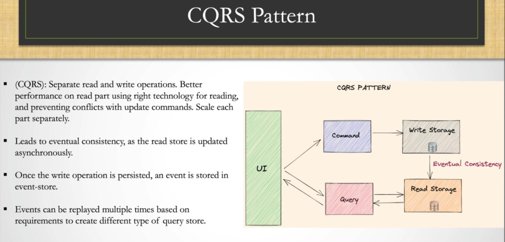

# CQRS

## Description

A pattern that involves separating the read and write models in a microservices architecture. The read model is optimized for querying data, while the write model is optimized for updating data.

Separates the read and write operations for data, allowing independent optimization and scaling.

- ما بین لایه اپلیکیشن و دیتابیس اعمال میشه
- هدف جداسازی فرایند کامند و کوئری دیتا در دیتا استوریج هستش
- با اعمال این پترن، به راحتی در زمان کامند کردن (ذخیره) دیتا توی دیتا استوریج اصلی میتونیم ایونت ایجاد کنیم و به وسیله این ایونت اون دیتارو توی دیتابیس های سرچ و NoSQL هم ذخیره کنیم.

## Architecture

