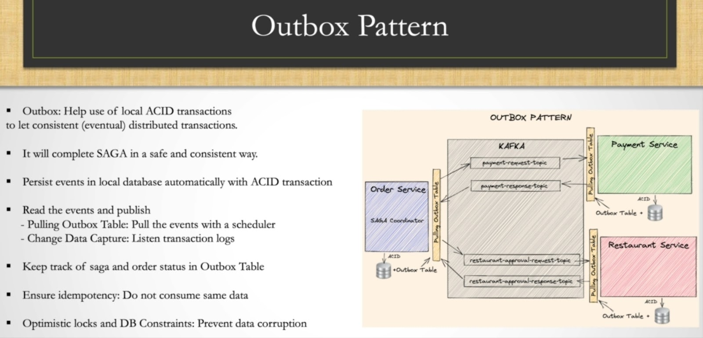

# Outbox

## Description

The Outbox Pattern is a software design pattern often used in microservices architecture to ensure reliable communication between services, particularly when integrating with external systems or ensuring data consistency.

## Key Concepts

- **Outbox Table:**

   - Within your service's database, you maintain an additional table called the "Outbox."
   - Whenever an event or operation occurs that needs to trigger a message (e.g., sending an email, or updating another service), you first record this event in the Outbox table as a transactional part of the operation.

- **Transaction Management:**

   - The service's primary operation and the recording of the event in the Outbox table are done within the same database transaction. This ensures that either both succeed or both fail, maintaining consistency.

- **Event Dispatcher:**

   - A separate process or component periodically scans the Outbox table for new entries.
   - This process then reads these entries and sends the corresponding messages or events to the appropriate external systems or services.
   - Once confirmed, the entry in the Outbox table is marked as processed or deleted.

## Benefits

- **Reliability:** Ensures that messages are not lost due to failures or errors. If the dispatch fails, the entry remains in the Outbox and can be retried.
- **Consistency:** Guarantees that messages are only sent if the associated operation is successfully committed to the database.
- **Decoupling:** The actual sending of messages is decoupled from the main transaction, reducing the risk of errors and delays.

## Use Cases

- Sending email notifications after a successful database update.
- Publishing events to a message broker like Kafka or RabbitMQ.
- Ensuring eventual consistency across microservices.

In short, the Outbox Pattern helps maintain data consistency and reliability in distributed systems by decoupling event generation from event dispatch.

## Example

