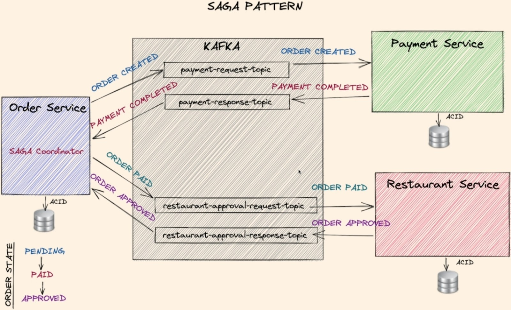

# Saga

## Description

A pattern used to manage transactions that span multiple microservices. It involves breaking the transaction into smaller, individual steps and using compensating actions to undo completed steps if an error occurs.

Manages transactions spanning multiple services by breaking them into steps and providing compensating actions if something goes wrong.

