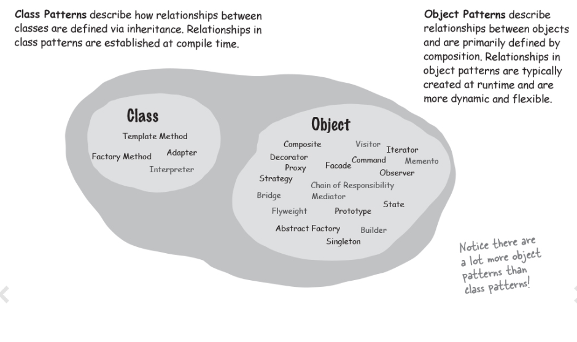
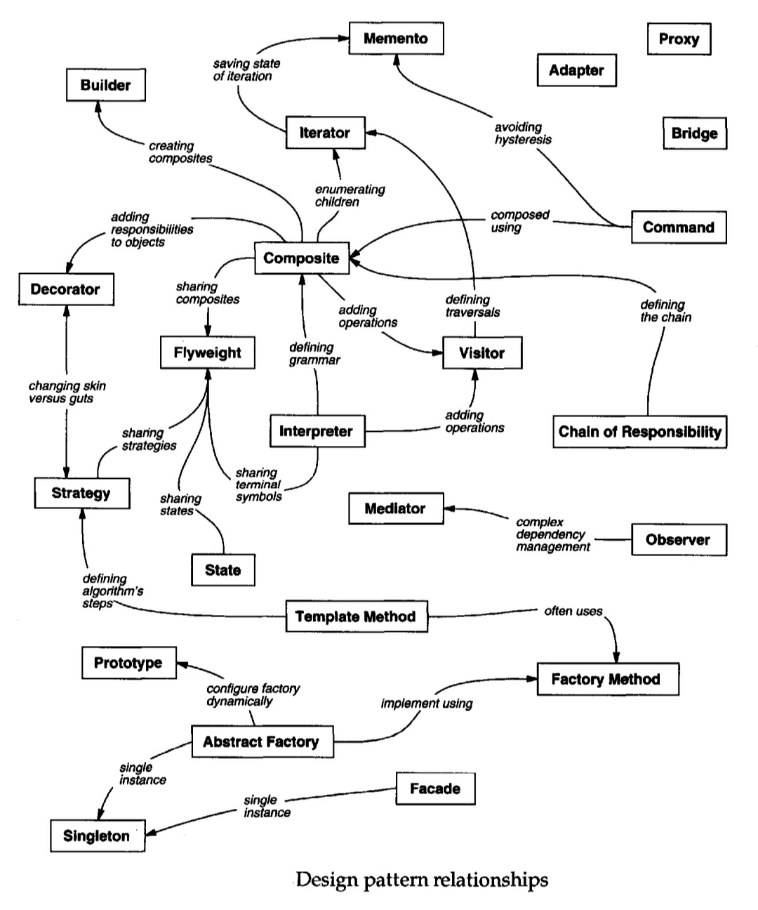
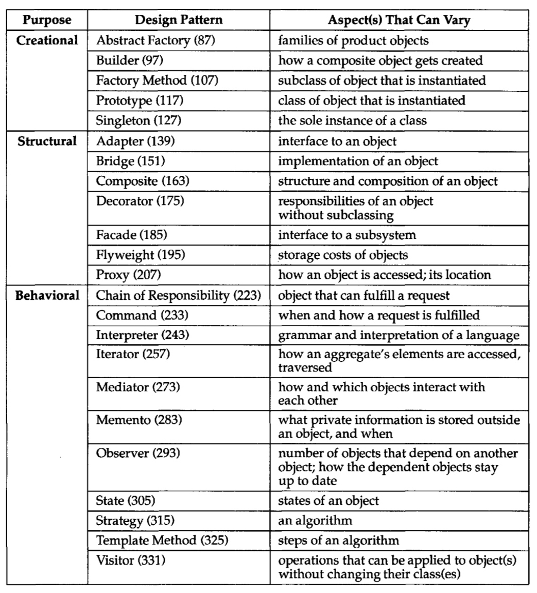

# _Overview

## Creational Design Patterns

Creational design patterns are concerned with the way of creating objects. These design patterns are used when a decision must be made at the time of the instantiation of a class (i.e. creating an object of a class).

This pattern can be further divided into class-creation patterns and object-creational patterns. While class-creation patterns use inheritance effectively in the instantiation process, object-creation patterns use delegation effectively to get the job done.

حاشیه: دیزاین پترن هایی که روی نحوه ساخت آبجکت ها تمرکز دارن کریشنال میگن.

## Structural Design Patterns

Structural design patterns are concerned with how classes and objects can be composed, to form larger structures. The structural design patterns simplify the structure by identifying relationships.

These patterns focus on how the classes inherit from each other and how they are composed of other classes.

Structural class-creation patterns use inheritance to compose interfaces. Structural object patterns define ways to compose objects to obtain new functionality.

حاشیه: دیزاین پترن هایی که روی نحوه ارتباط آبجکت ها با هم تمرکز دارن استراکچرال میگن.

## Behavioral Design Patterns

Behavioral design patterns are concerned with the interaction and responsibility of objects. In these design patterns, the interaction between the objects should be in such a way that they can easily talk to each other and still should be loosely coupled.

That means the implementation and the client should be loosely coupled to avoid hard coding and dependencies.

## Class Patterns & Object Patterns

## Design Pattern Relationships

## Each Pattet for What Aspect

حاشیه: در جدول بالا به راحتی میتونیم ببینیم هر پترن کمک به داینامیک شدن چه جنبه ای میکنه (هدف از دیزاین پترن ها ایزوله کردن بخش هایی از کد هست که در آینده ممکنه تغییر کنن)
