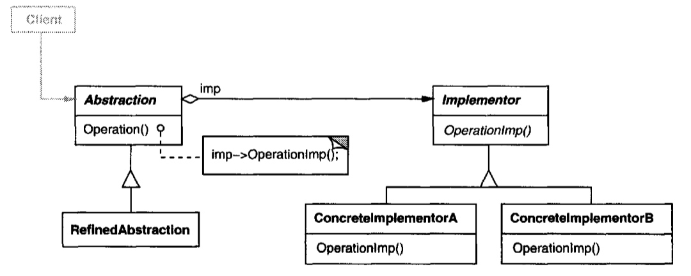
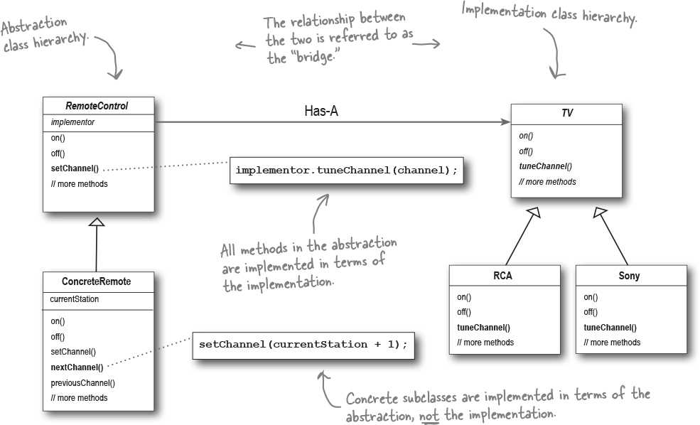

# Bridge (Decoupled abstraction) [Structural]

## Description

Decouple an abstraction from its implementation so that the two can vary independently.

حاشیه ها:

- خیلی شبیه به دیزاین پترن استراتژی هستش، با این تفاوت که استراتژی جزو بیهیورال پترن هاست اما بریدج جزو استراکچرال پترن هاست، به بیان دیگه از این پترن برای کم کردن تعداد کلاس های سیستم استفاده میشه.
- مثلا اگر در یک پروژه، یو آی صفحات به صورت زیر هستند

   - آیتم طولانی کتاب و آیتم کوتاه کتاب
   - آیتم طولانی مجله و آیتم کوتاه مجله
   - آیتم طولانی نویسنده و آیتم کوتاه نویسنده
   - آیتم طولانی خواننده و آیتم کوتاه خواننده

- می توانیم آنها را به دو دسته زیر تقسیم کنم:

   - آیتم: طولانی و کوتاه
   - منابع: کتاب، مجله، نویسنده، خواننده

- با این کار تعداد کلاس های پروژه از ۸ به ۶ کاهش پیدا میکنه (در تعداد بالاتر بیشتر خودشو نشون میده) و به راحتی در زمان ران تایم کامبینیشن های مختلف از این کلاس هارو میتونیم ترکیب کنیم و صفحات دلخواهمون رو تشکیل بدیم.
