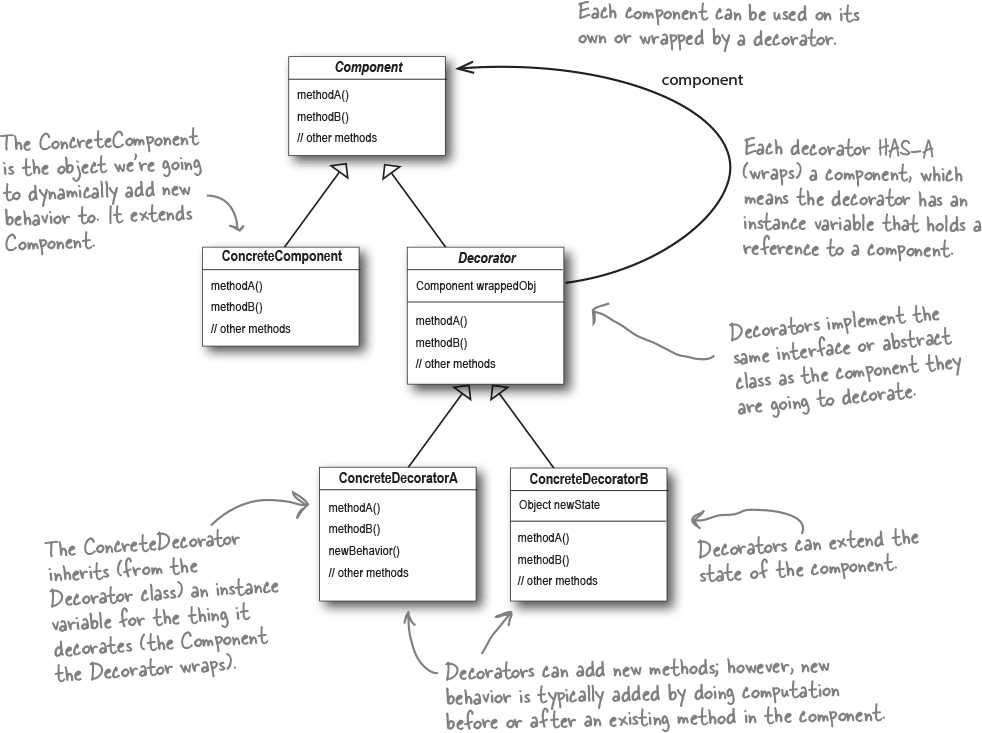
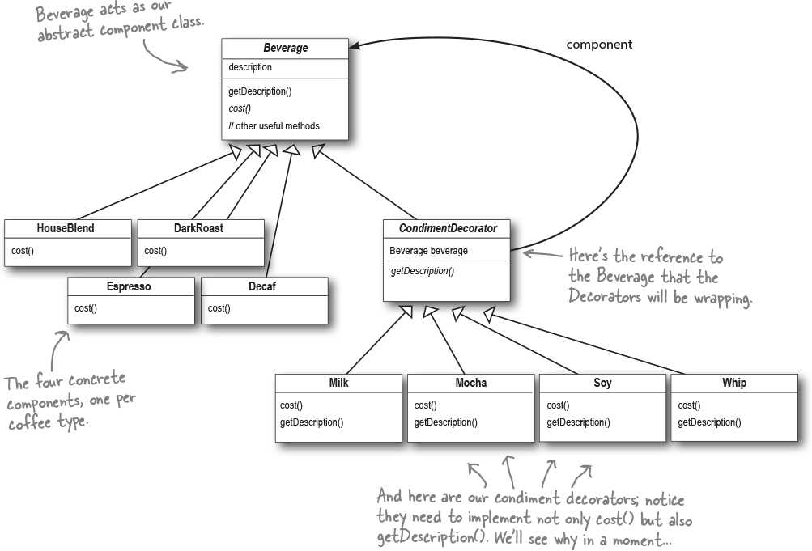
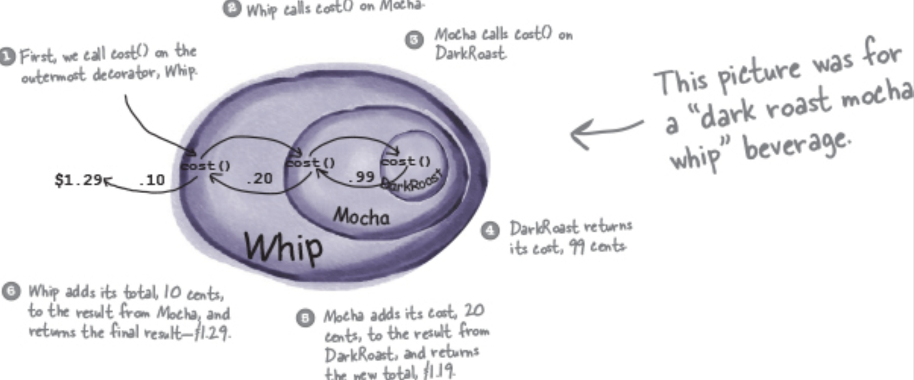

# Decorator (Dynamic object enhancement) [Structural]

## Description

Attaches additional responsibilities to an object dynamically. Decorators provide a flexible alternative to subclassing for extending functionality.

While that describes the role of the Decorator Pattern, it doesn’t give us a lot of insight into how we’d apply the pattern to our implementation.

حاشیه ها:

- ماله زمانی خوبه که ما میخوایم کامبینیشن های مختلفی از کلاس های یک اینترفیس رو داشته باشیم و هر کدوم قراره دیتای قبلی رو بگیره و دیتای خودشو بهش اضافه کنه.
- به بیان رسمی تر، تغییر در مسئولیت های یک آبجکت در ران تایم، بجای ارث بری و تغییر در کامپایل تایم.
