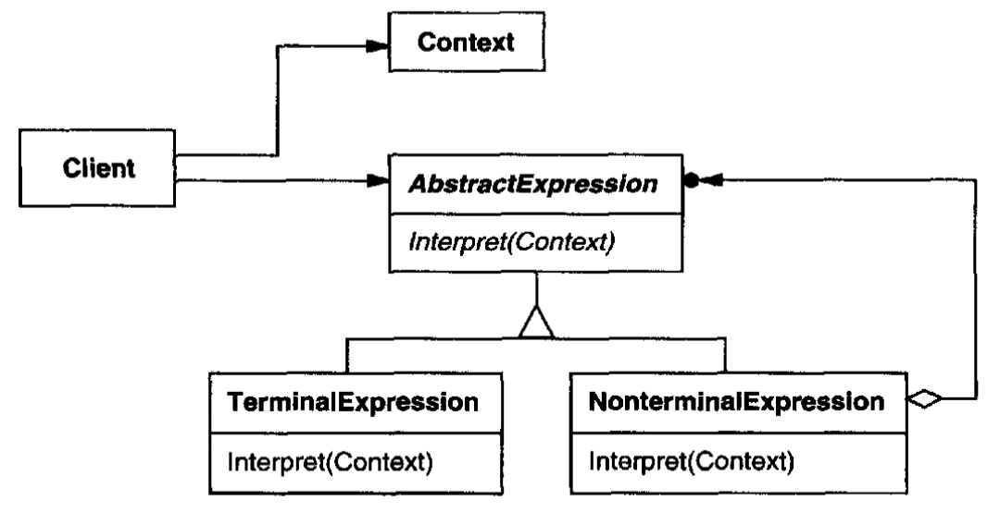

# Interpreter (Language parsing engine) {Behavioral}

## Description

Given a language, define a representation for its grammar along with an interpreter that uses the representation to interpret sentences in the language.
