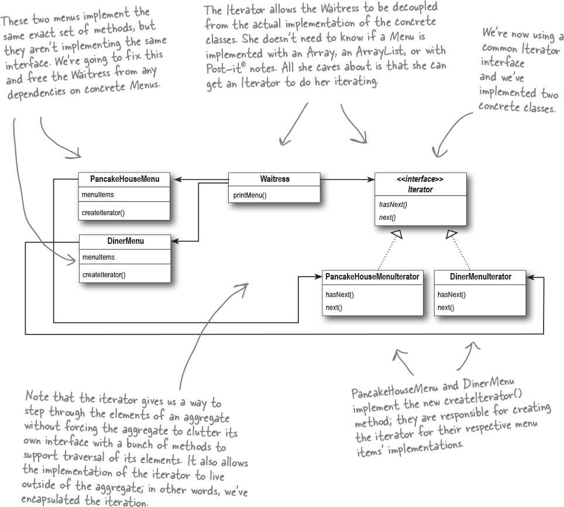

# Iterator (Sequential access) [Behavioral]

## Description

The Iterator Pattern provides a way to access the elements of an aggregate (data collection) object sequentially without exposing its underlying representation.

This makes a lot of sense: the pattern gives you a way to step through the elements of an aggregate without having to know how things are represented under the covers.

The Iterator Pattern allows traversal (iterating) of the elements of an aggregate without exposing the underlying implementation.

It also places the task of traversal on the iterator object, not on the aggregate, which simplifies the aggregate interface and implementation and places the responsibility where it should be.

حاشیه: بخش کال کردن متد کریت ایتریتور کاملا مطابق با دیزاین پترن فکتوری متد طراحی شده (یعنی واگذار کردن پیاده سازی بخشی از الگوریتم از سوپر کلاس به ساب کلاس)
