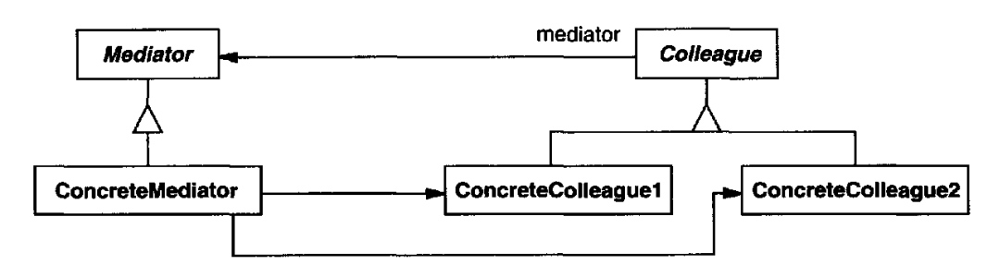

# Mediator (Centralized communication) {Behavioral}

## Description

Define an object that encapsulates how a set of objects interact. Mediator promotes loose coupling by keeping objects from referring to each other explicitly, and it lets you vary their interaction independently.

!!! info

    - کاربردش در جایی هستش که چندین آبجکت با پیچیدگی بالا به هم دیگه نیاز دارن، در این صورت یه مدیاتور میسازیم که ارتباط بین آبجکت هارو کنترل کنه (اصطلاحا آبجکت ها از هم دیکاپل بشن)
    - سیستم های مسیج بروکر پترنی مشابه با این پترن دارند
