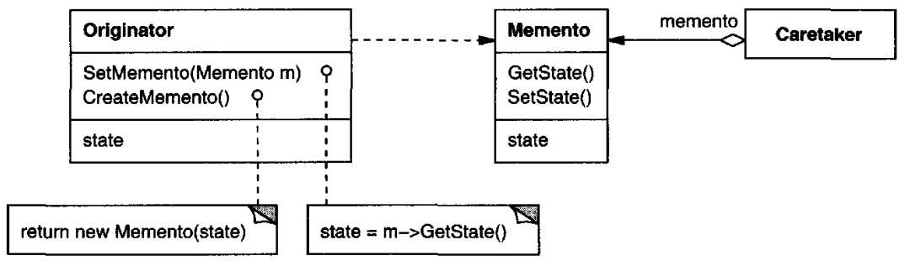

# Memento (State preservation) [Behavioral]

## Description

Without violating encapsulation, capture and externalize an object's internal state so that the object can be restored to this state later.

!!! info

    در این الگو یه ممنتو (اسنپ شات) از استیت اوریجینیتور (آبجکت هدف) تهیه میکنیم و اون رو به کریتر (لیست اسنپ شات ها) میسپاریم تا در آینده در صورت نیاز اوریجینیتور را بهش برگردانیم. (مثلا بوک مارک یک کتاب)
