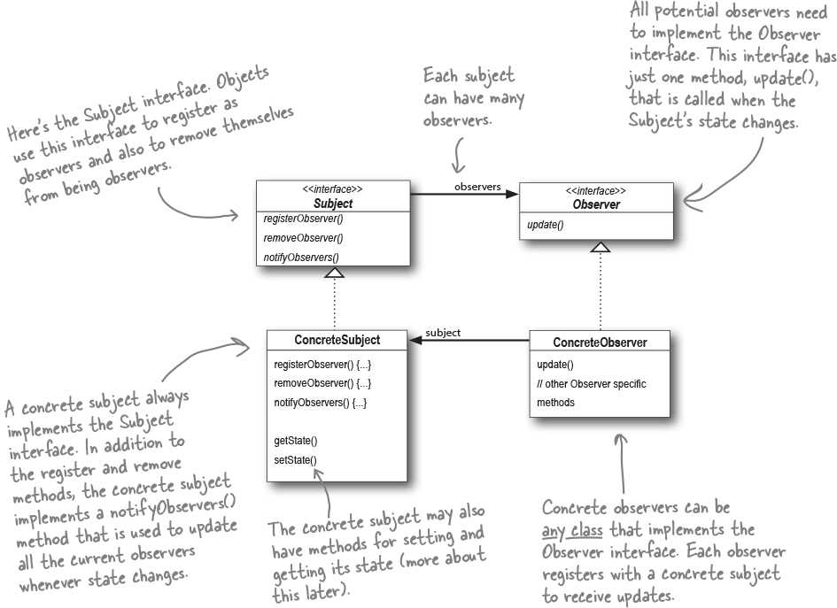
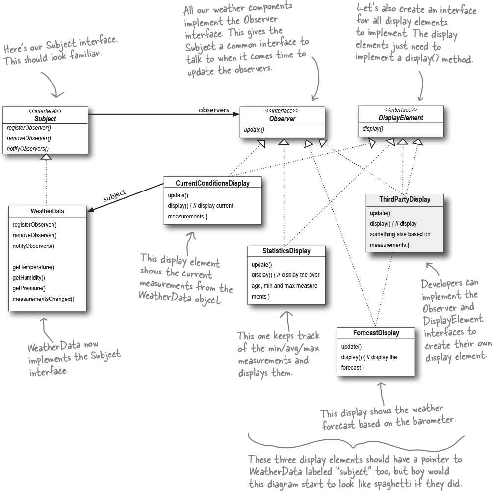

# Observer (Event notification system) [Behavioral]

## Description

Defines a one-to-many dependency between objects so that when one object changes state, all its dependents are notified and updated automatically.

حاشیه: تو این پترن میشه یه کار باحال کرد، اونم اینه که موقع این که کلاس مولد داره کلاس های مصرف کننده رو از تغییر با خبر میکنه، بجای این که دونه دونه دیتا پاس بده بهشون بیاد خودشو (self) پاس بده و یه چنتا متد پابلیک داشته باشه و کلاس های مصرف کننده هر کدوم بسته به این که کدوم دیتا رو نیاز دارن یکی یا چنتا از این متد های پابلیک رو کال کنن.
