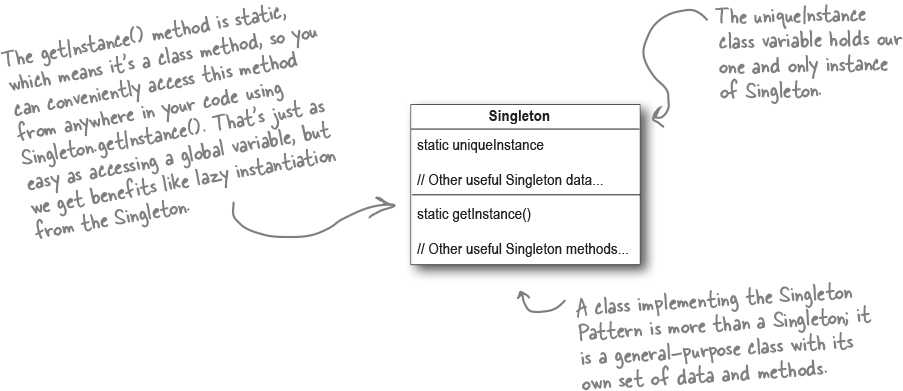

# Singleton (Single instance control) [Creational]

## Description

Ensures a class has only one instance, and provides a global point of access to it.

The Singleton is created in a lazy manner, which is especially important for resource-intensive objects.

حاشیه ها:

- خیلیا میگن که از این پترن نباید استفاده کرد، چون ممکنه ما از یک کلاس فقط یک نمونه داشته باشیم، ولی حق نداریم مجبورش کنیم که فقط و فقط یک نمونه داشته باشه، میتونیم با تعریف یه گلوبال متغیر یا هر چیز مشابه دیگه مشکل رو رفع کنیم و نیازی به سینگلتون نباشه
- نکته بعدی هم اینه که چون داریم با خود کلاس کار میکنیم نه اینترفیسش، باعث بالا رفتن کاپلینگ میشه و یونیت تست رو سخت میکنه
