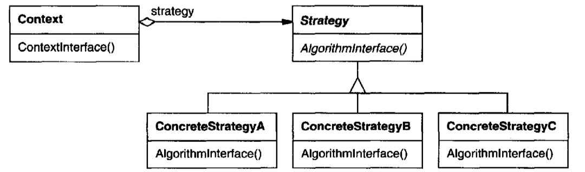
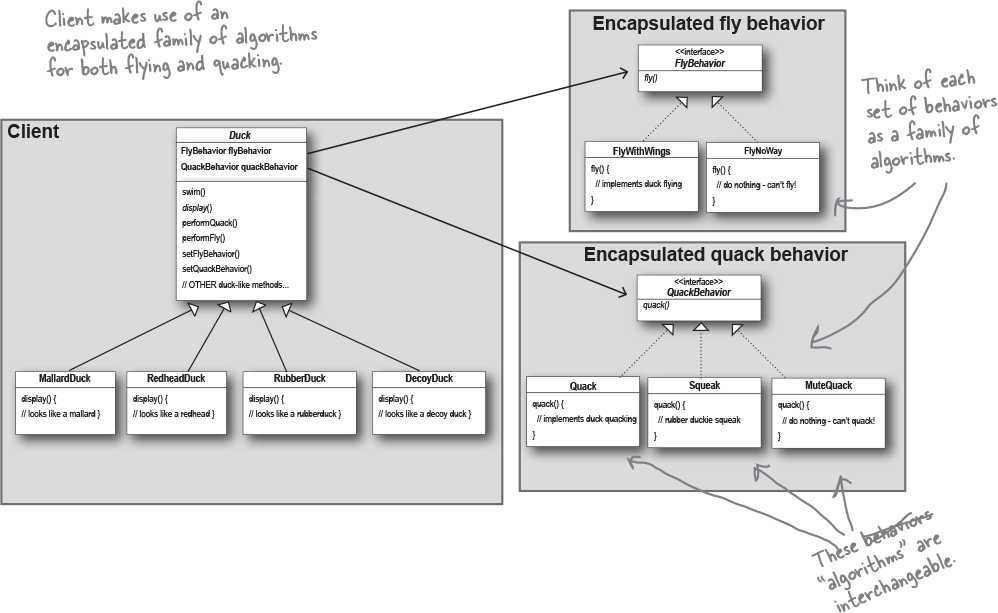

# Strategy (Flexible algorithm selection) [Behavioral]

## Description

Defines a family of algorithms, encapsulates each one, and makes them interchangeable. Strategy lets the algorithm vary independently from clients that use it.

!!! info

    - حرف اصلی این پترن استفاده از کامپوزیشن بجای ارث بری هستش
    - به طور مثال بجای ارث برای تولید انواع اردک، بیایم کلاس های مختلفی از رفتار های اردک رو درست کنیم (مثلا نوع صدا، این که پرواز میکنه یا نه، قیافه اردک و …) و کامبینیشن های مختلف از این رفتارهارو کنار هم بذاریم و اردک های مختلف درست کنیم
    - حتی فراتر از این، اگر قبلا برای هر مدل ادک یه کلاس جدا داشتیم، با این روش میتونیم کلا اون کلاس هارو پاک کنیم و فقط یه کلاس داشته باشیم که این کابینیشن های مختلف رو قبول میکنه
