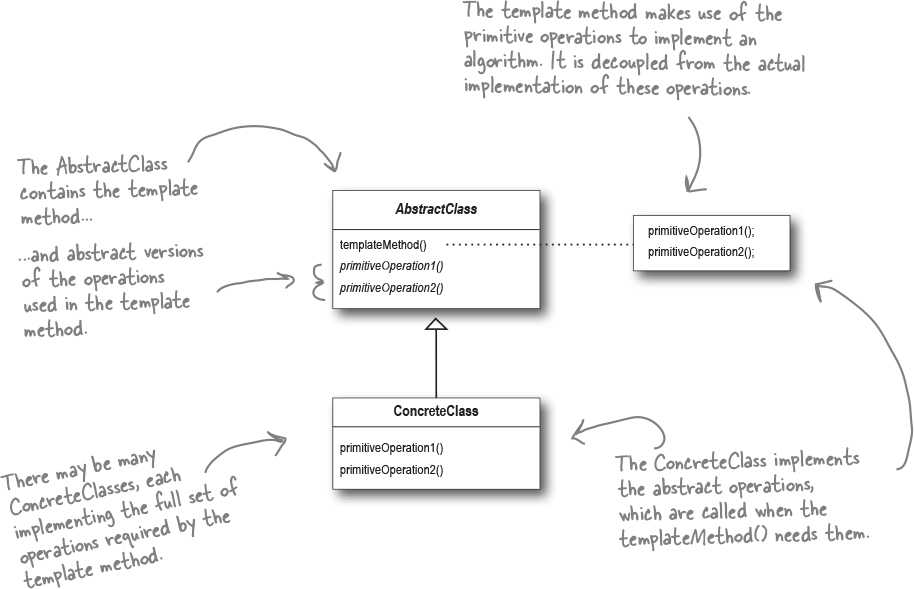

# Template Method (Template with hooks) [Behavioral]

## Description

Defines the skeleton of an algorithm in a method, deferring some steps to subclasses. The template method lets subclasses redefine certain steps of an algorithm without changing the algorithm’s structure.

This pattern is all about creating a template for an algorithm.

حاشیه ها:

- این پترن مشابه پترن استراتژی هست با این تفاوت که از اینهریتنس بجای کامپوزیشن استفاده میکنه، بابت همین موضوع بهتره تا حد امکان از این پترن استفاده نشه
- حالا علت این که چرا اکثر فریمورک ها از این پترن استفاده میکنن، بخاطر اینه که خیلی استفاده ازش ساده س و تعداد کلاس های کمتری نیازه ساخته بشه

## Hooked on Template Method

A hook is a method that is declared in the abstract class, but only given an empty or default implementation. This gives subclasses the ability to “hook into” the algorithm at various points if they wish; a subclass is also free to ignore the hook.
