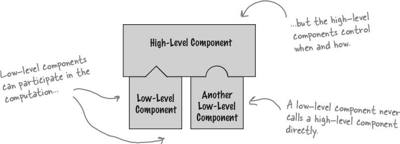

# Hollywood Principle

## Description

Gives us a way to prevent "dependency rot." Dependency rot happens when you have high-level components depending on low-level components depending on high-level components depending on sideways components depending on low-level components, and so on. When rot sets in, no one can easily understand the way a system is designed.

With the Hollywood Principle, we allow low-level components to hook themselves into a system, but the high-level components determine when they are needed, and how. In other words, the high-level components give the low-level components the "don’t call us, we’ll call you" treatment.

حاشیه: منظور از های لول کامپوننت، آنهایی هستند که سطح ابسترکشن بالاتری دارند و لو لول کامپوننت ها، آنهایی هستند که به کانکریت ها نزدیک ترند، توجه شود که این حرف به معنی آن نیست که لو لول کامپوننت ها حق صدا زدن های لول کامپوننت ها را ندارند، بلکه به این معنی است که نباید اجازه دهیم این حرکت سینوسی باشد، کال کردن ها یا از بالا به پایین باشد یا از پایین به بالا، نه سینوسی.

## In Frameworks

This pattern shows up so often because it’s a great design tool for creating frameworks, where the framework controls how something gets done, but leaves you (the person using the framework) to specify your details about what is happening at each step of the framework’s algorithm.
