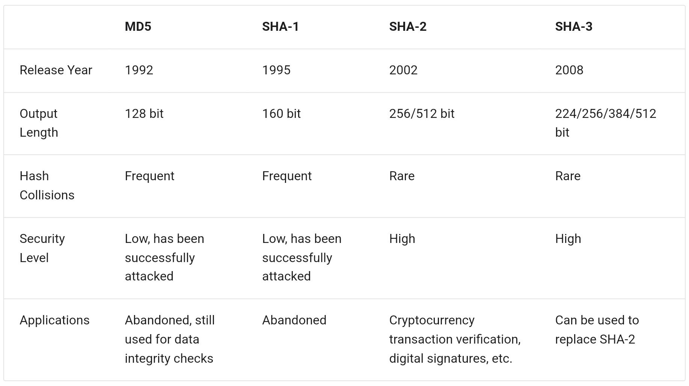

# MD5 & SHA

## Description

- **MD5** and **SHA-1** have been successfully attacked multiple times and are thus abandoned in various security applications.
- **SHA-2** series, especially SHA-256, is one of the most secure hash algorithms to date, with no successful attacks reported, hence commonly used in various security applications and protocols.
- **SHA-3** has lower implementation costs and higher computational efficiency compared to SHA-2, but its current usage coverage is not as extensive as the SHA-2 series.
