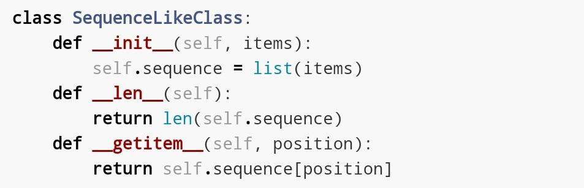
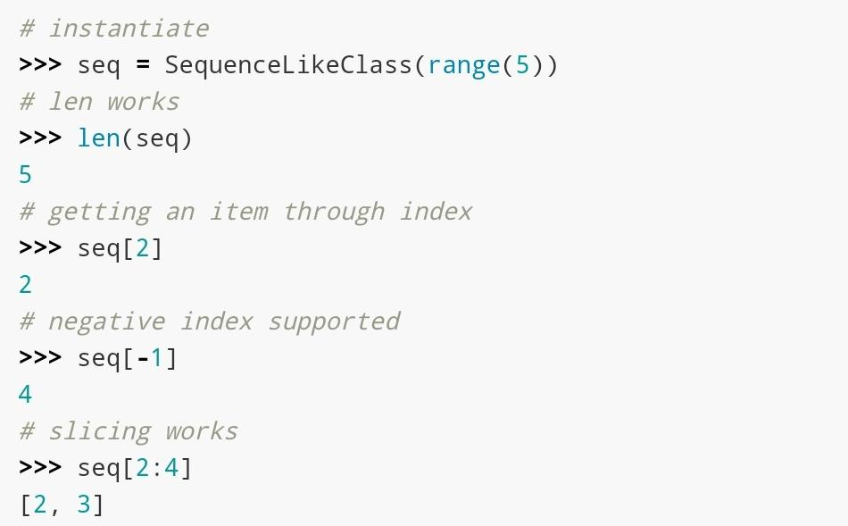
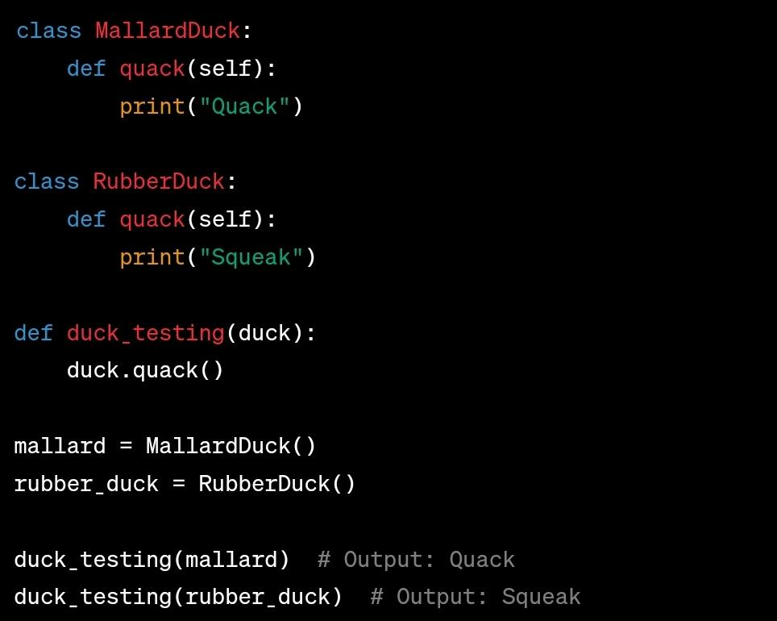

# Duck Typing

## Description

Duck typing determines an object's type based on its behavior, not its explicit type.

In the context of Object Oriented Programming, a protocol is an informal interface, defined only in documentation and not in code.
For example, the sequence protocol in Python entails just the __len__ and __getitem__ methods.
Any class Spam that implements those methods with the standard signature and semantics can be used anywhere a sequence is expected.
Whether Spam is a subclass of this or that is irrelevant, all that matters is that it provides the necessary methods.

## Example

The following example shows how the sequence protocol works.
SequenceLikeClass implements the sequence protocol by duck typing: to equip with special methods __len__ and __getitem__, which are methods corresponding to the sequence protocol.

Although it does not inherit from a sequence class like a list, it behaves well like some sequence class.

Another example:

