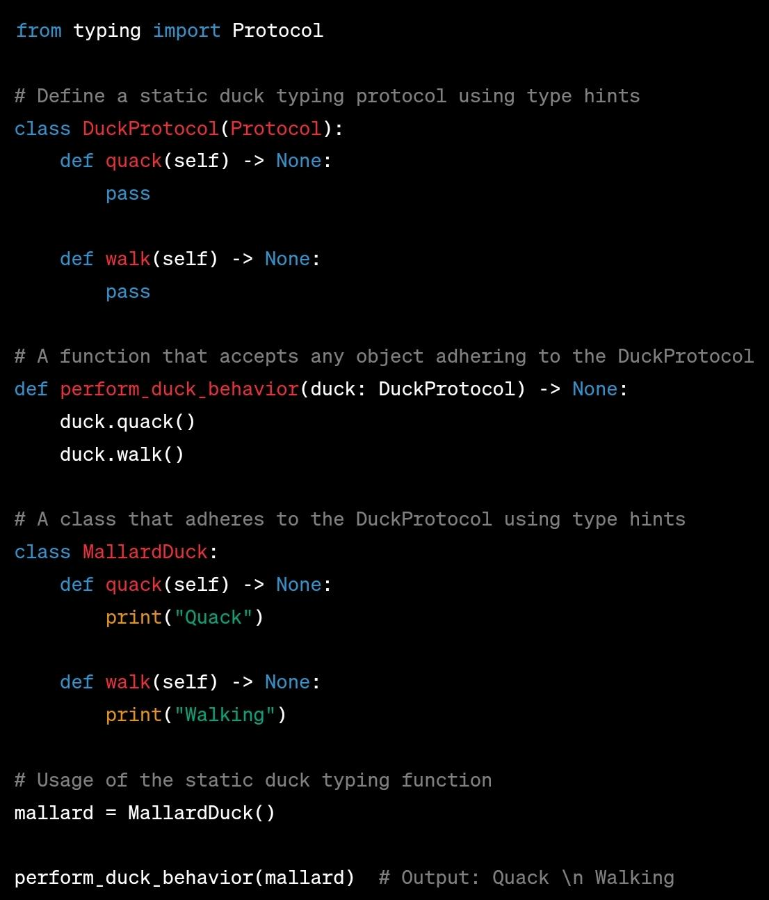

# Static Duck Typing (Structural Subtyping)

## Description

Static duck typing in Python typically involves using type hints to specify the expected behavior of objects without explicitly defining their types.

