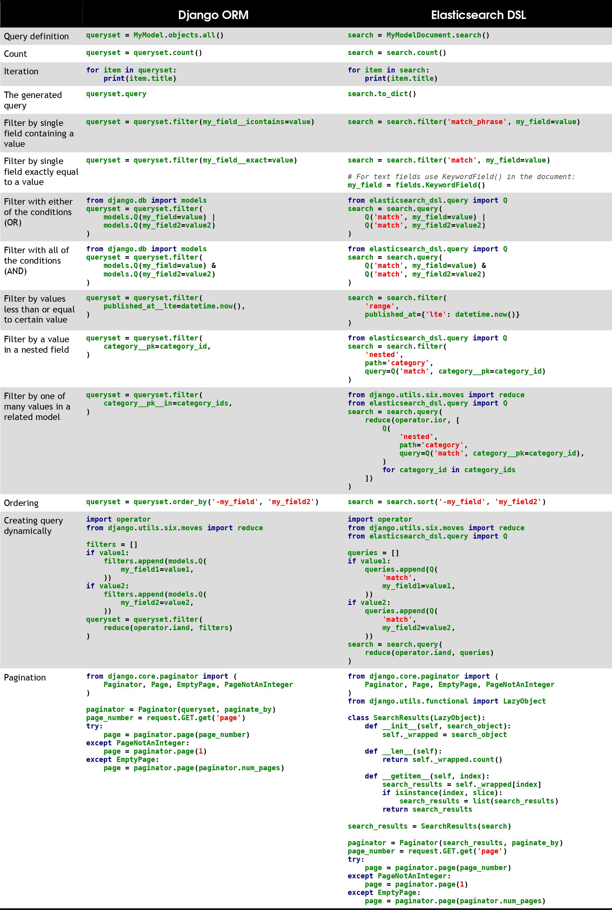

# Elasticsearch

## Document

### query simple

```bash
curl -X GET "http://localhost:9200/_search?pretty" -u <username_and_password: elastic:pass123>
```

### query complex

```bash
curl -X GET "http://localhost:9200/<index_name>/<_search or _count>?pretty" -H 'Content-Type: application/json' -d '{
  "from": <offset: 5>,
  "size": <limit: 20>,
  "fields": ["<field_1>", "<field_2>"],
  "_source": false,
  "query": {
    "bool": {
      "must": {
        "match": {"<field>": "<value>"}
      }
    }
  },
  "runtime_mappings": {
    "<custom_field>": {
      "type": "<field_type_in_java_format: double>",
      "script": {
        "source": "emit(doc[\"<another_field>\"].value * 2)"
      }
    }
  },
  "sort": [
    {"<field1>": "asc"},
    {"<field2>": "asc"}      
  ]
}'
```

### aggregate

```bash
curl -X GET "http://localhost:9200/<index_name>/_search?pretty" -H 'Content-Type: application/json' -d '{
  "size": 0,  # will only return aggregate results
  "aggs": {
    "<agg_name_1>": {"avg": {"field": "<field>"}},
    "<agg_name_2>": {
      "filter": {"match": {"<field>": "<value>"}},
      "aggs": {
        "<nested_agg_name_1>": {"avg": {"field": "<field>"}}
      }
    }
  }
}'
```

### create

```bash
curl -X POST "http://localhost:9200/<index_name>/_doc?pretty" -H 'Content-Type: application/json' -d '{
  "<field>": "<value>"
}'
```

### update

```bash
# fully replace
curl -X PUT "http://localhost:9200/<index_name>/_doc/<_id>?pretty" -H 'Content-Type: application/json' -d '{
  "<field>": "<value>"
}'
```

### get

```bash
# return document and its related data
curl -X GET "http://localhost:9200/<index_name>/_doc/<_id>?pretty"
```

```bash
# return document only
curl -X GET "http://localhost:9200/<index_name>/_source/<_id>?pretty"
```

### delete

```bash
curl -X DELETE "http://localhost:9200/<index_name>/_doc/<_id>?pretty"
```

### bulk

Provides a way to perform multiple `index`, `create`, `delete`, and `update` actions in a single request.

- The `index` and `create` actions expect a source on the next line.
- `update` expects that the partial `doc`, upsert, and script and its options are specified on the next line.
- `delete` does not expect a source on the next line

Tip: Because this format uses literal `\n`'s as delimiters, make sure that the JSON actions and sources are not pretty printed.

```bash
curl -X POST "http://localhost:9200/<index_name>/_bulk?pretty" -H 'Content-Type: application/json' -d '
{"index": {"_id": "<document_id>"}}
{"<field>": "<value>"}

{"delete": {"_id": "<document_id>"}}

{"create": {"_id": "<document_id>"}}
{"<field>": "<value>"}

{"update": {"_id": "<document_id>"}}
{"doc": {"<field>": "<value>"}}
'
```

## Index

### get all

```bash
curl -X GET "http://localhost:9200/_aliases?pretty"
```

### create simple

```bash
curl -X PUT "http://localhost:9200/<index_name>?pretty"
```

### create with mapping

```bash
curl -X PUT "http://localhost:9200/<index_name>?pretty" -H 'Content-Type: application/json' -d '{
  "mappings": {
    "dynamic": "<dynamic_type: strict>",
    "properties": {
      "<field>": {
        "type": "<data_type>"
      }
    }
  }
}'
```

### delete

```bash
curl -X DELETE "http://localhost:9200/<index_name>?pretty"
```

```bash
curl -X DELETE "http://localhost:9200/<index1>,<index2>,<index3>?pretty"
```

```bash
# action.destructive_requires_name=false
curl -X DELETE "http://localhost:9200/*?pretty"
```

## Mapping

### get current

```bash
curl -X GET "http://localhost:9200/<index_name>/_mapping?pretty"
```

### create or update

```bash
curl -X PUT "http://localhost:9200/<index_name>/_mapping?pretty" -H 'Content-Type: application/json' -d '{
  "dynamic": "<dynamic_type: strict>",
  "properties": {
    "<field>": {
      "type": "<data_type>"
    }
  }
}'
```

### delete

There is no way to delete a field from mapping. Even if you delete all documents that contain this field

## clustering


## Elasticsearch DSL and Django ORM

