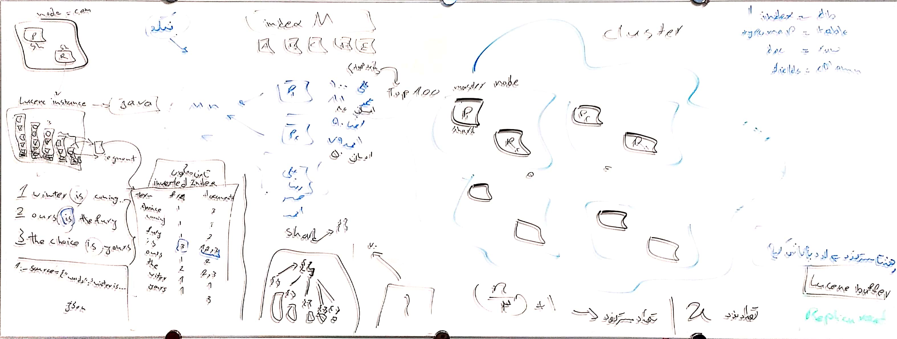

# Elasticsearch

## Links

- [Unrecognized Vm Option &#39;Useparnewgc&#39;](https://stackoverflow.com/questions/49623648/logstash-with-java10-get-error-unrecognized-vm-option-useparnewgc#answer-50307073)
- [Uninstall Elasticsearch](https://serverfault.com/questions/699977/ubuntu-uninstall-elasticsearch/749019#answer-749019)
- [More Like This No Result](https://stackoverflow.com/questions/40236844/elasticsearch-more-like-this-no-result#answer-40237868)

## Projects

- [Docker Elk](https://github.com/deviantony/docker-elk)

## Document

- Simple query:

  ```
  curl -X GET "http://localhost:9200/_search?pretty" -u <username_and_password: elastic:pass123>
  ```

- Complex query:

  ```
  curl -X GET "http://localhost:9200/<index_name>/<_search or _count>?pretty" -H 'Content-Type: application/json' -d '{
    "from": <offset: 5>,
    "size": <limit: 20>,
    "_source": ["<field_1>", "<field_2>"],
    "query": {
      "bool": {
        "must": {
          "match": {"<field>": "<value>"}
        }
      }
    },
    "runtime_mappings": {
      "<custom_field>": {
        "type": "<field_type_in_java_format: double>",
        "script": {
          "source": "emit(doc[\"<another_field>\"].value * 2)"
        }
      }
    },
    "sort": [
      {"<field1>": "asc"},
      {"<field2>": "asc"}      
    ]
  }'
  ```

- Aggregate:

  ```
  curl -X GET "http://localhost:9200/<index_name>/_search?pretty" -H 'Content-Type: application/json' -d '{
    "size": 0,  # will only return aggregate results
    "aggs": {
      "<agg_name_1>": {"avg": {"field": "<field>"}},
      "<agg_name_2>": {
        "filter": {"match": {"<field>": "<value>"}},
        "aggs": {
          "<nested_agg_name_1>": {"avg": {"field": "<field>"}}
        }
      }
    }
  }'
  ```

- Create:

  ```
  curl -X POST "http://localhost:9200/<index_name>/_doc?pretty" -H 'Content-Type: application/json' -d '{
    "<field>": "<value>"
  }'
  ```

- Update:

  ```
  # fully replace
  curl -X PUT "http://localhost:9200/<index_name>/_doc/<_id>?pretty" -H 'Content-Type: application/json' -d '{
    "<field>": "<value>"
  }'
  ```

- Get:

  ```
  # return document and its related data
  curl -X GET "http://localhost:9200/<index_name>/_doc/<_id>?pretty"
  ```

  ```
  # return document only
  curl -X GET "http://localhost:9200/<index_name>/_source/<_id>?pretty"
  ```

- Delete:

  ```
  curl -X DELETE "http://localhost:9200/<index_name>/_doc/<_id>?pretty"
  ```

- Bulk:

  Provides a way to perform multiple `index`, `create`, `delete`, and `update` actions in a single request.

  - The `index` and `create` actions expect a source on the next line.
  - `update` expects that the partial `doc`, upsert, and script and its options are specified on the next line.
  - `delete` does not expect a source on the next line

  ```
  # Tip: Because this format uses literal `\n`'s as delimiters, make sure that the JSON actions and sources are not pretty printed
  
  curl -X POST "http://localhost:9200/<index_name>/_bulk?pretty" -H 'Content-Type: application/json' -d '
  {"index": {"_id": "<document_id>"}}
  {"<field>": "<value>"}
  
  {"delete": {"_id": "<document_id>"}}
  
  {"create": {"_id": "<document_id>"}}
  {"<field>": "<value>"}
  
  {"update": {"_id": "<document_id>"}}
  {"doc": {"<field>": "<value>"}}
  '
  ```

## Index

- Get all:

  ```
  curl -X GET "http://localhost:9200/_aliases?pretty"
  ```

- Create simple:

  ```
  curl -X PUT "http://localhost:9200/<index_name>?pretty"
  ```

- Create with mapping:

  ```
  curl -X PUT "http://localhost:9200/<index_name>?pretty" -H 'Content-Type: application/json' -d '{
    "mappings": {
      "dynamic": "<dynamic_type: strict>",
      "properties": {
        "<field>": {
          "type": "<data_type>"
        }
      }
    }
  }'
  ```

- Alias:

  ```
  # Tip: The `remove` action will remove this alias from other indices
  
  curl -X POST "http://localhost:9200/_aliases?pretty" -H 'Content-Type: application/json' -d'{
    "actions": [
      {
        "remove": {
          "index": "*",
          "alias": "<alias_name>"
        }
      },
      {
        "add": {
          "index": "<index_name>",
          "alias": "<alias_name>"
        }
      }
    ]
  }'
  ```

- Delete:

  ```
  # One index
  curl -X DELETE "http://localhost:9200/<index_name>?pretty"
  
  # Multiple indices
  curl -X DELETE "http://localhost:9200/<index1>,<index2>,<index3>?pretty"
  
  # All (it needs: action.destructive_requires_name=false)
  curl -X DELETE "http://localhost:9200/*?pretty"
  ```

- Clone:

  ```
  # Make the source index readonly
  curl -X PUT "http://localhost:9200/<source_index_name>/_settings?pretty" -H 'Content-Type: application/json' -d'
  {
    "settings": {"index.blocks.write": true}
  }'
  
  # Clone
  curl -X POST "http://localhost:9200/<source_index_name>/_clone/<destination_index_name>?pretty"
  
  # Make the source index write able
  curl -X PUT "http://localhost:9200/<source_index_name>/_settings?pretty" -H 'Content-Type: application/json' -d'
  {
    "settings": {"index.blocks.write": false}
  }'
  ```

- Reindex:

  ```
  curl -X POST "http://localhost:9200/_reindex?pretty" -H 'Content-Type: application/json' -d'{
    "source": {"index": "<source_index_name>"},
    "dest": {"index": "<destination_index_name>"}
  }'
  ```

## Mapping

- Get current:

  ```
  curl -X GET "http://localhost:9200/<index_name>/_mapping?pretty"
  ```

- Create or update:

  ```
  # Tip: We can’t change the mapping or field type of an existing field. Changing an existing field could invalidate data that’s already indexed
  
  curl -X PUT "http://localhost:9200/<index_name>/_mapping?pretty" -H 'Content-Type: application/json' -d '{
    "dynamic": "<dynamic_type: strict>",
    "properties": {
      "<field>": {
        "type": "<data_type>"
      }
    }
  }'
  ```

- Delete: There is no way to delete a field from mapping. Even if you delete all documents that contain this field

## Other

- Clustering:

  

- Elasticsearch DSL & Django ORM:

  